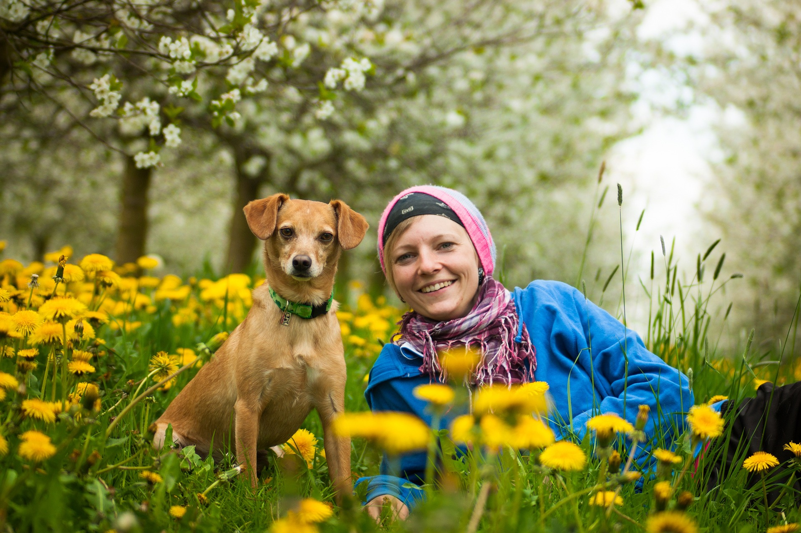

# 三月实验记录

## 3.24：实现了CLIP的效果复现以及原理理解

项目位置：D:\CLIP

环境设置：

```text
conda create -n clip python=3.10
pip install torch torchvision torchaudio --index-url https://download.pytorch.org/whl/cu121
pip install git+https://github.com/openai/CLIP.git
pip install -e .
python 
```

<div style="display: flex; gap: 16px;">
  
  
</div>

```python

import torch
import clip
import PIL.Image as Image

device = "cuda" if torch.cuda.is_available() else "cpu"

# Load the CLIP model
model, preprocess = clip.load("ViT-B/32", device=device)

# Example usage
text11 = clip.tokenize(["a photo of a cat", "a photo of a dog", "a photo of a car"]).to(device)
text12 = clip.tokenize(["a photo of a cat", "a dog", "a photo of a car"]).to(device)
text21 = clip.tokenize(["a photo of a cat", "a photo of a dog", "a photo of a car", "a photo of a person"]).to(device)
text22 = clip.tokenize(["a photo of a cat", "a photo of a dog", "a photo of a car", "a photo of a woman"]).to(device)
text23 = clip.tokenize(["a photo of a cat", "a photo of a dog", "a photo of a car", "a photo of a dog and a woman"]).to(device)
text24 = clip.tokenize(["a photo of a cat", "a photo of a dog", "a photo of a car", "a photo of a dog and a woman with a lot of flowers"]).to(device)


# Example image
image1 = preprocess(Image.open("../data/try1.jpg")).unsqueeze(0).to(device)
image2 = preprocess(Image.open("../data/try2.jpg")).unsqueeze(0).to(device)

with torch.no_grad():
    logits_per_image1, logits_per_text1 = model(image1, text11)
    probs11 = logits_per_image1.softmax(dim=-1)
    logits_per_image1, logits_per_text1 = model(image1, text12)
    probs12 = logits_per_image1.softmax(dim=-1)
    
    logits_per_image2, logits_per_text2 = model(image2, text21)
    probs21 = logits_per_image2.softmax(dim=-1)
    logits_per_image2, logits_per_text2 = model(image2, text22)
    probs22 = logits_per_image2.softmax(dim=-1)
    logits_per_image2, logits_per_text2 = model(image2, text23)
    probs23 = logits_per_image2.softmax(dim=-1)
    logits_per_image2, logits_per_text2 = model(image2, text24)
    probs24 = logits_per_image2.softmax(dim=-1)
    

print("预测概率11:", probs11)
print("预测概率12:", probs12)
print("---------------------------------------")
print("预测概率21:", probs21)
print("预测概率22:", probs22)
print("预测概率23:", probs23)
print("预测概率24:", probs24)
```

对应结果：

```text
预测概率11: tensor([[3.9444e-03, 9.9512e-01, 7.1812e-04]], device='cuda:0',
       dtype=torch.float16)
预测概率12: tensor([[0.0450, 0.9468, 0.0082]], device='cuda:0', dtype=torch.float16)
---------------------------------------
预测概率21: tensor([[1.0811e-02, 7.9443e-01, 3.4213e-04, 1.9458e-01]], device='cuda:0',
       dtype=torch.float16)
预测概率22: tensor([[8.1482e-03, 5.9863e-01, 2.5797e-04, 3.9282e-01]], device='cuda:0',
       dtype=torch.float16)
预测概率23: tensor([[2.2769e-05, 1.6747e-03, 7.1526e-07, 9.9854e-01]], device='cuda:0',
       dtype=torch.float16)
预测概率24: tensor([[5.3644e-07, 4.0710e-05, 0.0000e+00, 1.0000e+00]], device='cuda:0',
       dtype=torch.float16)
```

体现了提示词工程的重要性

## 3.26 实现了DETRv4的最小模型效果复现

```text
git clone https://github.com/RT-DETRs/RT-DETRv4.git 
修改requirement
pip install -r tools/inference/requirements.txt 
pip install torch torchvision --index-url https://download.pytorch.org/whl/cu121 
python -c "import torch; print(torch.cuda.is_available())"      
python tools/inference/torch_inf.py -c configs/rtv4/rtv4_hgnetv2_s_coco.yml -r .\rtv4_s_model\model.pth --input .\rtv4_s_model\DJI_20260212_220131_514_video.MP4 --device cuda:0  
```

<video controls style="width: 90%; max-width: 720px; display: block; margin: 16px auto;">
  <source src="../images/rt-detrv4.mp4" type="video/mp4">
</video>

效果并不尽如人意


---