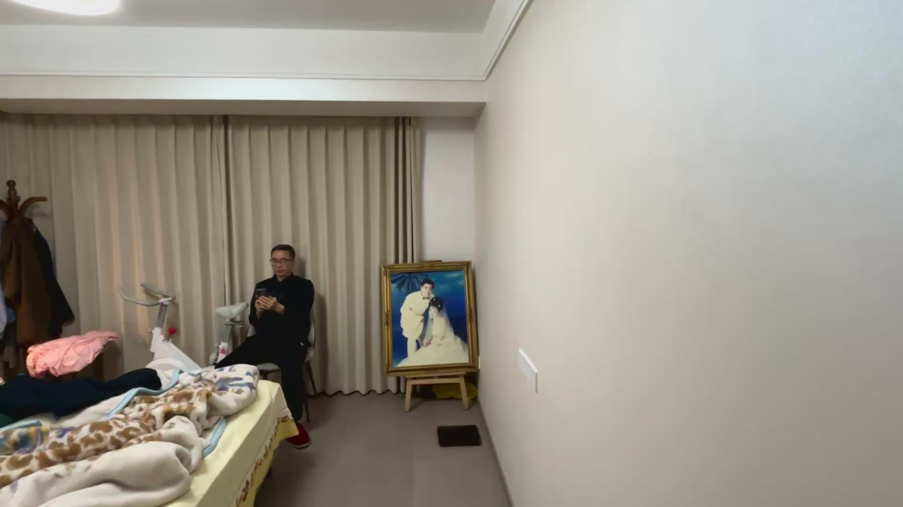
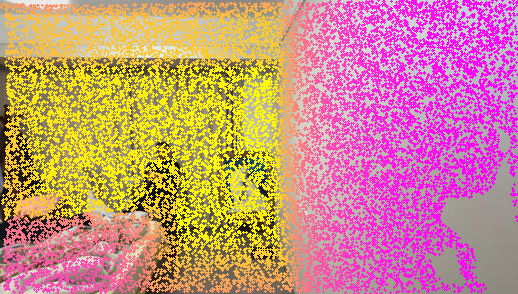

# 四月第一周实验记录

**实现了STREAM3R的效果可视化以及相关工作的复现并实现了三维点云效果的预览**

STREAM3R生成的是对应的npz以及glb文件，glb可以在网页端直接打开查看效果，npz中存储的是对应的点的信息，可以拆分成对应的pcd点云文件以及进行相应的投影工作。

<div style="display: flex; gap: 16px;">
  
  
</div>

```text
环境配置：
git clone https://github.com/NIRVANALAN/STream3R 
conda create -n stream3r python=3.11 cmake=3.14.0 -y 
pip install torch torchvision --index-url https://download.pytorch.org/whl/cu124
Get-Content requirements.txt | Where-Object { $_ -notmatch '^\s*deepspeed\s*$' } | Set-Content requirements-no-deepspeed.txt
pip install -r requirements-no-deepspeed.txt  
pip install -e . 
python -c "import torch; from stream3r.models.stream3r import STream3R; print('ok')"
$env:HF_ENDPOINT = "https://hf-mirror.com"
python inference_stream3r.py  

具体操作：
1. （1）对于视频进行抽帧 & 利用提供的模型window进行重建点云：python run_video_inference.py --video D:\3D_construction\STream3R\input\input1.mp4 --output-dir D:\3D_construction\STream3R\output\case1 --sample-fps 0.5 --max-frames 120 --mode window --streaming --save-glb  
（2）对于图片利用提供的模型window进行重建点云：python run_image_inference.py --image-dir D:\3DV\STream3R\output\case1\images --output-dir D:\3DV\STream3R\output\case1 --mode window --save-glb 

2. python extract_npz_to_pcd.py  将生成的npz文件拆分成点云pcd文件

3. python .\dealnpz\project_pcd_to_images.py --npz D:\3D_construction\STream3R\output\case1\predictions.npz --pcd-dir D:\3D_construction\STream3R\output\case1\pcd_frames --images-dir D:\3D_construction\STream3R\output\case1\images --output-dir D:\3D_construction\STream3R\output\case1\proj_vis0 --align preprocessed --preprocess-mode crop --depth-color --max-points-draw 20000    将点云投影到对应的图像中

4. python predictions.py    对npz文件进行分析
```

---