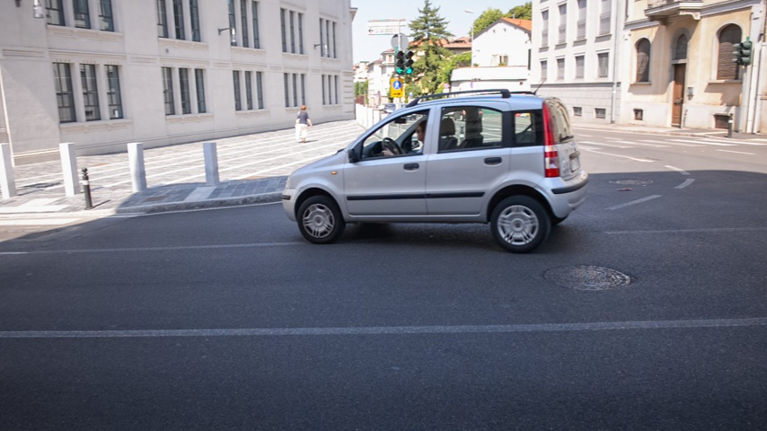
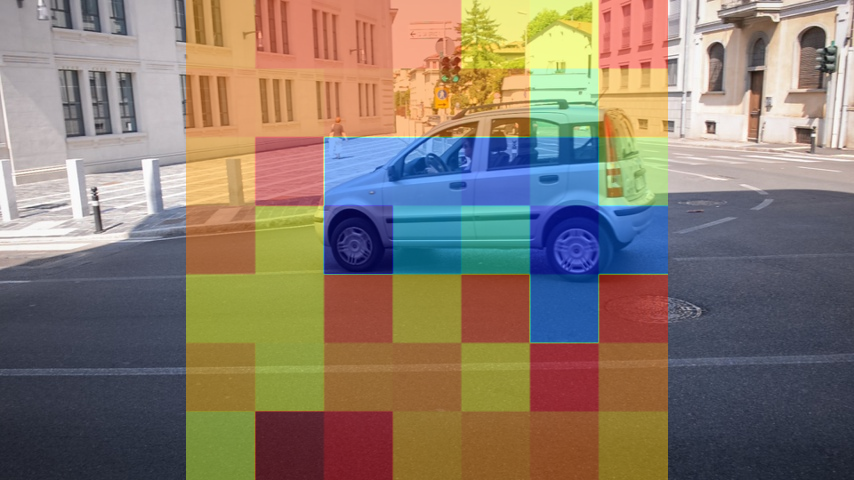
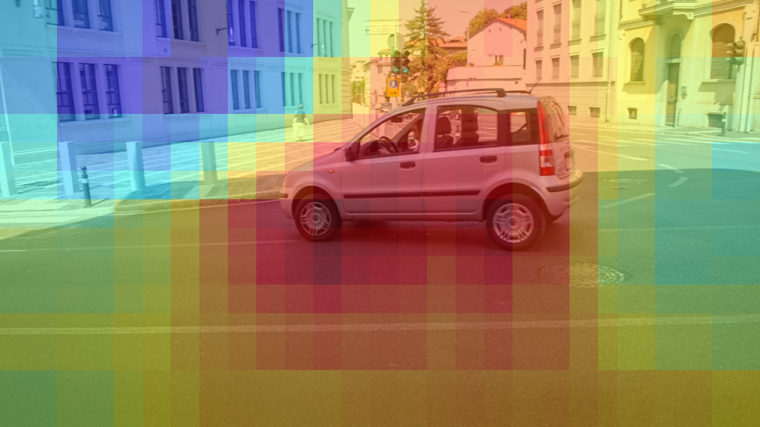
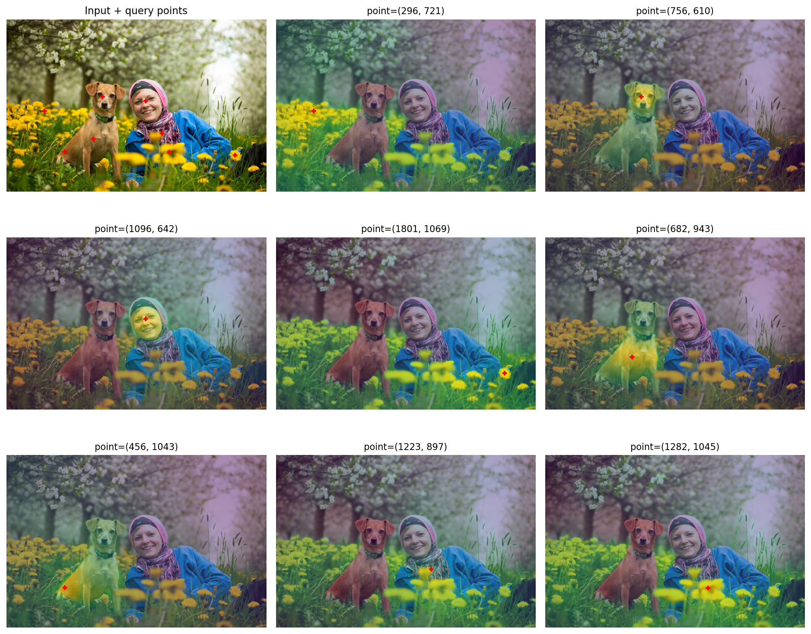
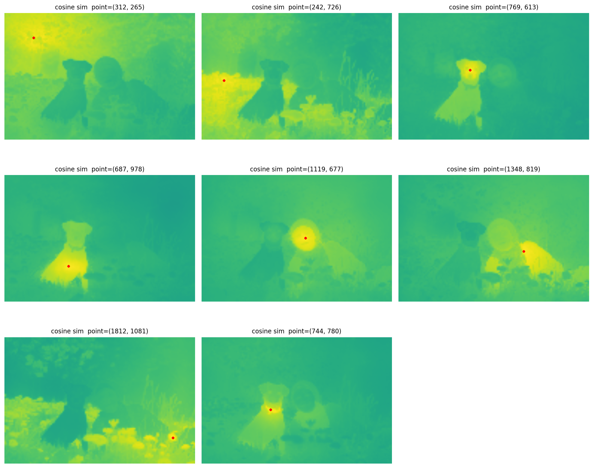
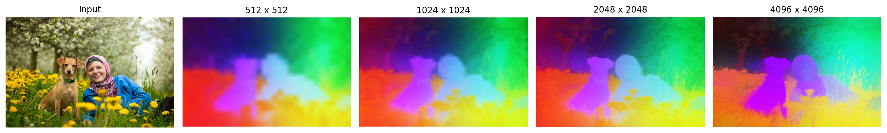

# 四月第二周实验记录

## 4.7：实现了CLIP中ViT最后一维embedding在二维图像的应用以及对三维点云的映射（效果不理想）

这里失败的主要原因是CLIP本身的ViT不具备局部的理解能力，盲目的使用patch token作为每个区域的结果并不是一个好的选择。这里做了三维的实验和二维的实验，效果都很不正确。

```text

将CLIP应用到解析出来的npz文件，点云文件，以及二维图像中

1. python scripts\inspect_stream3r_npz.py --npz "D:\3DV\STream3R\output\case0\predictions.npz" --image-dir "D:\3DV\STream3R\output\case0\images" --confidence-threshold 1.5 --max-points 30000 实现了数据格式的验证

2. python scripts\build_semantic_pointcloud.py --npz "D:\3DV\STream3R\output\case0\predictions.npz" --image-dir "D:\3DV\STream3R\output\case0\images" --text-query "a man" --confidence-threshold 1.5 --max-points 150000 将patch token应用到每一个区域，并在三维空间中查看最后的效果，错误的尝试！

3. python scripts\clip_text_heatmap_2d.py --image "D:\3DV\STream3R\output\case1\images\00.jpg" --text "a car in the road" --output-dir "outputs\clip_2d_case1" 降维到二维空间，仍然是错误的

```

<div style="display: flex; gap: 16px;">
  
  
</div>

但是我进行了对比实验，设计一个滑动窗，每个滑动窗单独做CLIP，最终结果再参与与文本的打分，并生成热力图

```text

python scripts\clip_text_heatmap_sliding_window.py --image "D:\3DV\STream3R\output\case1\images\00.jpg" --text "a car in the road" --window-height 160 --window-width 160 --stride-height 64 --stride-width 64 --output-dir "outputs\clip_2d_case1_sliding"
or
python scripts\clip_text_heatmap_sliding_window.py --image "D:\3DV\STream3R\output\case1\images\00.jpg" --text "a car in the road" --output-dir "outputs\clip_2d_case1_sliding"（默认宽度）

```

<div style="display: flex; gap: 16px;">
  
  
</div>

结果是正确的，但是这样浪费了过多的算力资源。

## 4.9 搭建了DINOv3的环境，并下载了对应的权重文件

```text

1. git clone https://github.com/facebookresearch/dinov3.git                       
2. conda create -n dinov3-py311 python=3.11 -y                                    
3. conda activate dinov3-py311
4. python -m pip install --upgrade pip                                              
5. pip install torch torchvision --index-url https://download.pytorch.org/whl/cu121 
6. pip install -r requirements.txt
7. pip install transformers>=4.56.0 pillow scikit-learn scipy matplotlib jupyter ipykernel requests 
8. python -m ipykernel install --user --name dinov3-py311 --display-name "Python (dinov3-py311)" 

```
这里本来想直接用jupyter notebook复现论文的结果的，但是被hugging face由于地区限制给卡死了，没办法，只有自己下载对应的权重文件，然后借助CURSOR进行相应的训练。

```text
1. python .\vic_try\try.py     # 这个是对DINOv3前向流程的验证过程，会正常输出一组维度
2. python .\vic_try\retrieval_eval.py    # 这个是对DINOv3模型的应用
```

## 4.10 实现了对原论文内容的复现

```text

1. python .\vic_try\paper_figures.py --weights "d:\DINO\dinov3\checkpoint\dinov3_vitb16_pretrain_lvd1689m-73cec8be.pth" --image "d:\DINO\dinov3\vic_try\images\try2.jpg" --pca-resolutions "512,1024,2048,4096" --pca-mask-mode none --out-dir "d:\DINO\dinov3\vic_try\outputs"    # 这个是对论文图4的复现，能在不同的分辨率下看到不同的效果

2. python .\vic_try\figure3_interactive.py --weights "d:\DINO\dinov3\checkpoint\dinov3_vitb16_pretrain_lvd1689m-73cec8be.pth" --image "d:\DINO\dinov3\vic_try\images\try2.jpg" --sim-resolution 2048 --max-points 8 --out-dir "d:\DINO\dinov3\vic_try\outputs"    # 这个是对论文图3的复现，只不过还是有原图，然后可以进行选点

3. python .\vic_try\figure3_similarity_paper_style.py --weights "d:\DINO\dinov3\checkpoint\dinov3_vitb16_pretrain_lvd1689m-73cec8be.pth" --image "d:\DINO\dinov3\vic_try\images\try2.jpg" --interactive --max-points 8 --out-dir "d:\DINO\dinov3\vic_try\outputs"    # 这个也是对图3的复现，不过是1:1的还原

```

<div style="display: flex; gap: 16px;">
  
  
</div>



---