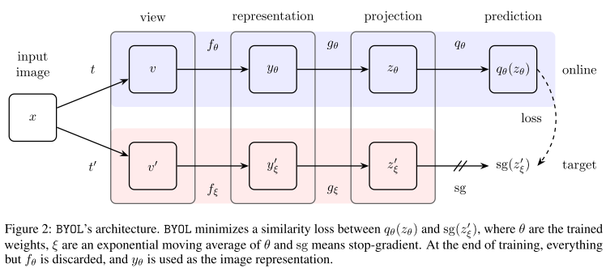

# RTDETR 阅读汇报

## 论文信息

- 标题：[Bootstrap your own latent: A new approach to self-supervised Learning]
- 作者 / 会议或期刊：NeurlPS
- 链接：[https://arxiv.org/abs/2006.07733](https://arxiv.org/abs/2006.07733)

## 一句话概括

不使用负样本对(negative pairs)，仅通过两个神经网络相互学习来获得高质量的图像表征。

## 方法要点

本文的核心贡献就是引入了BYOL这种自监督图像表征学习方法，该方法依赖于两个相互学习的神经网络——在线网络和目标网络，学习目标是从一张图片的一个增强视图出发，训练在线网络去预测同一张图片在另一个不同增强视图下的目标网络所生成的表征，同时，通过在线网络参数的缓慢移动平均来更新目标网络。BYOL可以做到不依赖任何负样本就能实现SOTA性能。

### 问题背景与初步探索

许多成功的自监督方法都基于跨视图预测框架，即让一个视图的表征去预测同一张图片另一个视图的表征。这种直接在表征空间进行预测的方法存在一个致命缺陷——表征坍缩，当时的主流解决方案是对比学习，对比学习方法将预测问题转化为一个判别问题。它不仅要拉近正样本对（同一图片的不同视图），还要推开负样本对（不同图片的视图）。通过引入大量负样本，模型被迫学习能够区分不同图片的、有判别力的特征，从而避免了坍缩。

举一个简化的SimCLR对比学习的框架来说明表征塌缩的问题：我们假设有两个类别的图像：苹果和香蕉。每个类别的图像通过数据增强生成两个增强版本。网络的目标是将同一类别的增强版本拉近距离，同时将不同类别的图像分开。每个图像都经过数据增强（如随机裁剪/随机旋转/色彩变换/随机翻转）之后，然后经过ResNet网络进行特征提取，并输出一个特征向量，再经过一个投影头如MLP将其映射到一个低维的潜在空间中，以便更好的计算相似度。

```text
假设输出：
苹果的第一个增强版本（apple_aug1）特征向量[0.8,0.7,0.9]
苹果的第二个增强版本（apple_aug2）: 特征向量[0.79,0.68,0.88]
香蕉的第一个增强版本（banana_aug1）: 特征向量[0.1,0.2,0.15]
香蕉的第二个增强版本（banana_aug2）: 特征向量[0.11,0.18,0.16]
```

然后计算余弦相似度来度量不同图像对之间的相似性，

1. 先计算同一物体的增强版本的相似度（正样本）

苹果的两个增强版本：cosine_similarity([0.8,0.7,0.9],[0.79,0.68,0.88])≈0.999，这表明，苹果的两个增强版本非常相似，余弦相似度接近1，符合预期。香蕉的两个增强版本：cosine_similarity([0.1,0.2,0.15],[0.11,0.18,0.16])≈0.999，这表明，香蕉的两个增强版本也非常相似，余弦相似度接近1，符合预期。

2. 计算不同物体的增强版本的相似度（负样本）

苹果和香蕉之间的相似度：cosine_similarity([0.8,0.7,0.9],[0.1,0.2,0.15])≈0.68，符合预期。另一组为：cosine_similarity([0.8,0.7,0.9],[0.11,0.18,0.16])≈0.62，同样表明它们是不同的类别，但相似度更低。

3. 可能发生的表征塌陷

如果我们没有引入负样本，网络可能会出现表征塌缩问题。此时，模型会将所有图像映射到非常相似的表示空间。这意味着，即使苹果和香蕉属于不同的类别，它们的表示也非常接近。假设在经过训练后，网络的输出（特征向量）被压缩到非常相似的表示，如：

苹果的增强版本：[0.5,0.5,0.5]；香蕉的增强版本：[0.5,0.5,0.5]

这样，不论输入的图像是苹果还是香蕉，它们的表示都非常相似，余弦相似度将接近1：这就意味着无论图像是苹果还是香蕉，模型都无法区分它们，导致表征塌缩。这种情况下，模型只学到了一个非常简单的表示，它无法有效地区分不同的图像。

4. 引入负样本解决表征塌陷

为了避免表征塌缩，通常引入 负样本对，通过强制模型区分不同类别的图像。通过在训练过程中添加足够的负样本（如苹果和香蕉的组合），模型会学到一种区分度更强的表示。

在训练过程中，我们引入了负样本，即苹果和香蕉的组合。这会给网络一个明确的信号，告诉它：苹果和香蕉是不同的类别，需要学会区分它们。通过这种方式，模型会被迫学到更有区分度的表示，从而避免了表征塌缩。在有负样本的情况下，苹果和香蕉的相似度会显著降低，这有助于模型学习到更具区分性的特征表示：

苹果和香蕉的相似度变为：cosine_similarity([0.8,0.7,0.9],[0.1,0.2,0.15])≈0.68，这个相似度远低于1，说明苹果和香蕉是不同类别。香蕉的增强版本和 苹果的增强版本也会有明显的区别：cosine_similarity([0.5,0.5,0.5],[0.1,0.2,0.15])≈0.18。这表明，尽管我们可能把所有图像映射到了一个更小的表示空间，但它们之间的差异依然足够大。

而BYOL的核心问题就是或许负样本并不是不可或缺的，完全可以用两个网络取进行代替。

### 具体方法



简单来说，将处理过后的两个图片分别输入在线网络以及目标网络，这里的在线网络包括编码层-投影层-预测层，目标网络形同在线网络但无预测层，更新时在线网络正常反向传播进行更新，而目标网络经过：θtarget​=α⋅θtarget​+(1−α)⋅θonline​ 进行动量平滑更新，最终目的是让二者的特征表示接近（这里的编码层可以是ResNet18, 投影层/预测层都可以是MLP网络）。

这里二者是相互制约的关系，目标网络的滑动平均更新是相对较慢变化的过程，可以消除随机性，同时可以提供一个稳定的表示；预测头的存在防止了系统的表征坍塌，他要去拟合一个动态变化的目标

还是回到香蕉&苹果预测的例子：苹果的两个增强版本：apple_aug1, apple_aug2；香蕉的两个增强版本：banana_aug1, banana_aug2。现在引入两个网络，在线网络快速更新，目标网络相对较慢；此时apple_aug1 → online → z_a1 → predictor → q_a1，apple_aug2 → target → z_a2'。

首先经历随机的初始化，二者指向随机的向量。第一步：进行优化，q(apple_aug1)→z(apple_aug2)target，也就是说online 要去追target的输出，但 target 不是静止的，它是：θtarget​←0.99⋅θtarget​+0.01⋅θonline​，可以看作是一个历史平均。第二步，这里多加的预测头打破了过去会导致塌陷的“直接等于”的捷径，如果没有predictor,loss会变成zonline​≈ztarget​，这会带来一个危险的解就是所有输入指向同一个常数向量c，但是预测头之后q=g(zonline​)≈ztarget​，这里多出来的一层解决了这个问题，因为 predictor 要去拟合一个动态变化的目标。

综上，苹果和香蕉不会被强行合并，假设某一时刻，z_target(apple) ≈ [0.8, 0.7, 0.9]，z_target(banana) ≈ [0.2, 0.3, 0.1]。而在线网络要做的就是q(apple_aug1) → 逼近 [0.8, 0.7, 0.9]，q(banana_aug1) → 逼近 [0.2, 0.3, 0.1]。苹果被拉向“苹果的 target”，香蕉被拉向“香蕉的 target”。即它们一开始就不同，而 BYOL 的机制会“保留这种不同”。

**BYOL它不是通过“推开苹果和香蕉”来避免塌缩，而是通过一个“缓慢变化的老师（target）”，让每个样本去对齐自己的历史，从而维持结构，而不是压平结构。**

在BYOL训练完成后，用于下游任务，如分类/检测的通常是在线网络的编码器部分，尽管目标网络也很强大，但其本质上滞后于在线网络，在线网络是直接被优化以完成预测任务的那个网络，代表了模型在当前训练阶段所能达到的最佳状态。

### 代码实现

```python

import torch
import torch.nn as nn
import torch.nn.functional as F


# ============================
# 1. ResNet BasicBlock
# ============================
class BasicBlock(nn.Module):
    def __init__(self, in_planes, out_planes, stride=1):
        super().__init__()

        self.conv1 = nn.Conv2d(in_planes, out_planes, 3, stride, 1, bias=False)
        self.bn1 = nn.BatchNorm2d(out_planes)

        self.conv2 = nn.Conv2d(out_planes, out_planes, 3, 1, 1, bias=False)
        self.bn2 = nn.BatchNorm2d(out_planes)

        self.shortcut = nn.Sequential()
        if stride != 1 or in_planes != out_planes:
            self.shortcut = nn.Sequential(
                nn.Conv2d(in_planes, out_planes, 1, stride, bias=False),
                nn.BatchNorm2d(out_planes)
            )

    def forward(self, x):
        out = F.relu(self.bn1(self.conv1(x)))
        out = self.bn2(self.conv2(out))
        out += self.shortcut(x)
        out = F.relu(out)
        return out


# ============================
# 2. ResNet18 Encoder 天然没有fc层
# ============================
class ResNet18_Encoder(nn.Module):
    def __init__(self, dense=False):
        super().__init__()
        self.dense = dense

        self.conv1 = nn.Conv2d(3, 64, 7, 2, 3, bias=False)
        self.bn1 = nn.BatchNorm2d(64)
        self.relu = nn.ReLU(inplace=True)
        self.maxpool = nn.MaxPool2d(3, 2, 1)

        self.layer1 = self._make_layer(64, 64, 1)
        self.layer2 = self._make_layer(64, 128, 2)
        self.layer3 = self._make_layer(128, 256, 2)
        self.layer4 = self._make_layer(256, 512, 2)

        if not dense:
            self.avgpool = nn.AdaptiveAvgPool2d((1, 1))

    def _make_layer(self, in_planes, out_planes, stride):
        return nn.Sequential(
            BasicBlock(in_planes, out_planes, stride),
            BasicBlock(out_planes, out_planes, 1)
        )

    def forward(self, x):
        x = self.relu(self.bn1(self.conv1(x)))
        x = self.maxpool(x)

        x = self.layer1(x)
        x = self.layer2(x)
        x = self.layer3(x)
        x = self.layer4(x)

        if self.dense:
            return x  # (B,512,H/32,W/32)
        else:
            x = self.avgpool(x)
            x = torch.flatten(x, 1)
            return x  # (B,512)

# ============================
# 3. MLP
# ============================
class MLP(nn.Module):
    def __init__(self, in_dim, hidden_dim=4096, out_dim=256):
        super().__init__()
        self.net = nn.Sequential(
            nn.Linear(in_dim, hidden_dim),
            nn.BatchNorm1d(hidden_dim),
            nn.ReLU(inplace=True),
            nn.Linear(hidden_dim, out_dim)
        )

    def forward(self, x):
        return self.net(x)

# ============================
# 4. BYOL
# ============================
class BYOL(nn.Module):
    def __init__(self, projection_dim=256, hidden_dim=4096, m=0.99, dense=False):
        super().__init__()

        self.m = m
        self.dense = dense

        # -------- encoder --------
        self.online_encoder = ResNet18_Encoder(dense=dense)
        self.target_encoder = ResNet18_Encoder(dense=dense)

        feat_dim = 512

        # -------- projector --------
        self.online_projector = MLP(feat_dim, hidden_dim, projection_dim)
        self.target_projector = MLP(feat_dim, hidden_dim, projection_dim)

        # -------- predictor --------
        self.predictor = MLP(projection_dim, hidden_dim, projection_dim)

        self._init_target()

        # target 不参与梯度
        for p in self.target_encoder.parameters():
            p.requires_grad = False
        for p in self.target_projector.parameters():
            p.requires_grad = False


    def _init_target(self):
        for o, t in zip(self.online_encoder.parameters(), self.target_encoder.parameters()):
            t.data.copy_(o.data)
        for o, t in zip(self.online_projector.parameters(), self.target_projector.parameters()):
            t.data.copy_(o.data)


    @torch.no_grad()
    def update_target(self):
        for o, t in zip(self.online_encoder.parameters(), self.target_encoder.parameters()):
            t.data = self.m * t.data + (1 - self.m) * o.data
        for o, t in zip(self.online_projector.parameters(), self.target_projector.parameters()):
            t.data = self.m * t.data + (1 - self.m) * o.data


    def forward(self, x1, x2):

        # -------- online --------
        h1 = self.online_encoder(x1)
        h2 = self.online_encoder(x2)

        if self.dense:
            # flatten spatial
            h1 = h1.mean(dim=[2,3])
            h2 = h2.mean(dim=[2,3])

        z1 = self.online_projector(h1)
        z2 = self.online_projector(h2)

        q1 = self.predictor(z1)
        q2 = self.predictor(z2)

        # -------- target --------
        with torch.no_grad():
            t1 = self.target_projector(self._encode_target(x1))
            t2 = self.target_projector(self._encode_target(x2))

        loss = self.loss_fn(q1, t2) + self.loss_fn(q2, t1)
        return loss.mean()


    def _encode_target(self, x):
        h = self.target_encoder(x)
        if self.dense:
            h = h.mean(dim=[2,3])
        return h


    def loss_fn(self, q, z):
        q = F.normalize(q, dim=-1)
        z = F.normalize(z, dim=-1)
        return 2 - 2 * (q * z).sum(dim=-1)


'''
model = BYOL(dense=False).cuda()
optimizer = torch.optim.Adam(model.parameters(), lr=3e-4)

for x in dataloader:
    x = x.cuda()

    # 两个增强视角（非常关键）
    x1 = augment(x)
    x2 = augment(x)

    loss = model(x1, x2)

    optimizer.zero_grad()
    loss.backward()
    optimizer.step()

    model.update_target()

    print("loss:", loss.item())
'''

```

## 一些想法

本文提出的对比学习的方法消除了对负样本的依赖，为后面DINO的工作提供了极大的便利。

## 相关工作

[Emerging Properties in Self-Supervised Vision Transformers](https://arxiv.org/abs/2104.14294)