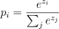
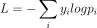
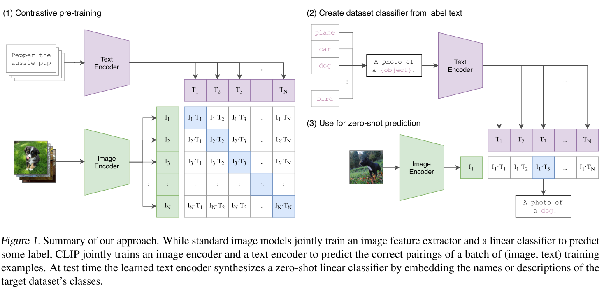

# CLIP 阅读汇报

## 论文信息

- 标题：Learning Transferable Visual Models From Natural Language Supervision
- 作者 / 会议或期刊：ICML
- 链接：[https://arxiv.org/abs/2103.00020](https://arxiv.org/abs/2103.00020)

## 一句话概括

把图像和文本映射到同一个语义空间，然后用相似度做匹配；首次通过大规模图像-文本对比学习，实现了无需任务特定微调的通用零样本图像分类能力。

## 背景介绍

传统模型通过固定类别标签学习图像到预定义类别的映射，类别权重硬编码在模型中; **CLIP则通过对比学习对齐图像与自然语言的语义空间，推理时用文本描述动态生成类别权重，实现开放词汇的零样本分类**

<details>
<summary>背景提要：传统的分类任务</summary>

以一个极简的3层CNN网络猫狗分类举例，先设定一个最小可运行模型，定义一个简单的网络：


```text
Input (32×32×3)
     ↓
Conv1 (3×3, stride=1, padding=1, out_channels=8)
     ↓
ReLU
     ↓
MaxPool (2×2)
     ↓
Conv2 (3×3, padding=1, out_channels=16)
     ↓
ReLU
     ↓
MaxPool (2×2)
     ↓
Conv3 (3×3, padding=1, out_channels=32)
     ↓
ReLU
     ↓
Global Average Pooling
     ↓
FC (2类：cat / dog)
     ↓
Softmax
```
0. 假设输入一张 32×32 的狗图像（有耳朵、鼻子、毛发），初始张量：(C×H×W)=(3×32×32)

1. 第一层Conv1(从像素->边缘)：output=8, kernel_size=3, 输出：(8×32×32)

这一层：此时还完全没有“狗”的概念

channel 1：水平边缘

channel 2：垂直边缘

channel 3：颜色变化

...

2. MaxPool(第一次降采样)

2×2 pooling，尺寸变为(8×16×16)

意义：降低分辨率；保留最强响应（重要特征）

3. 第二层Conv2(局部结构)

输入：(8×16×16)

输出：(16×16×16)

这一层开始组合边缘：耳朵轮廓；毛发纹理；眼睛局部结构

4. 再Pool: (16x8x8)

5. 第三层Conv3(语义雏形)

输入：(16x8x8)

输出：(32x8x8)

这一层开始接近语义，尽管网络不知道“这是狗脸”，只是统计上学到这种模式 → dog标签常出现；某些channel可能变成：

channel 5：狗脸模式

channel 12：猫耳朵模式

channel 20：鼻子形状

6. Global Average Pooling

对每个channel：把(32x8x8)变成(32)；得到x = [x₁, x₂, ..., x₃₂]

直觉理解：

x₅：狗脸模式出现强度

x₁₂：猫耳朵模式强度

x₂₀：鼻子模式强度

7. 分类：

全连接层（各自的权重连接，例如猫一个权重，狗一个权重, Wcat​∈R32, Wdog​∈R32）

->计算得分(scat​=Wcat​⋅x, sdog​=Wdog​⋅x)

->softmax(P(dog) = 0.95, P(cat) = 0.05)

```text
x（这张狗图） = [0.1, 0.3, ..., 2.5, ..., 0.2]
W_dog 在“狗脸”“鼻子”维度上权重大，W_cat 在“猫耳朵”维度上权重大
结果：s_dog = 4.2，s_cat = 1.1
```

**CNN把一张图像压缩成一个语义向量，然后用这个向量去匹配“类别方向”，每个 channel ≈ 一个“检测器”，例如某个channel对“狗脸”（“猫耳朵”）敏感**

**真正学习到的是权重值：所有图像共享同一套权重，而训练的目标是让这套权重能把不同图像映射到“可分的特征空间”，不同图像 → 不同的 x，但是整个CNN共用一套参数，所有图像共用**

8. softmax与交叉熵损失

Softmax 的作用是：把一组任意实数（logits）变成“概率分布”，让大的更大，小的更小

给定输出：z = [z1, z2, z3, ..., zn]，经过softmax之后：



交叉熵损失(Cross-Entropy)用来衡量预测概率和真实分布的差距。

对于单个样本：



其中，y_i是真实标签，p_i是预测概率(softmax输出)

```text
模型输出 logits
        ↓
Softmax → 概率分布
        ↓
CrossEntropy → 和真实标签比较
        ↓
反向传播 → 更新参数
```

</details>

<details>
<summary>背景提要：NLP带来的技术革命</summary>

**模型通过预测任务，把语言的“统计规律”编码进向量空间，使得语义、语法、知识都转化为“向量关系 + 概率分布”**

0. 以GPT-3为例，语言模型可以理解为：
```text
文本 → token → embedding → Transformer → 概率分布 → 生成文本**
```

1. token作为文本的最小单元，也是模型处理的基本输入单元，把自然语言变成模型可以处理的离散单位。例如：

```text
"The cat is playing"
→ ["The", "cat", "is", "play", "ing"]
```

2. 然后Embedding语义向量空间相当于把token映射到向量空间中的一个点，其核心性质是：通过向量的接近来表示语义的相似，这里相似的计算常用余弦相似度：

```text
cat   → [0.9, 0.3, 0.1]
dog   → [0.85, 0.25, 0.15]
table → [-0.4, 0.7, 0.2]
```

3. 整体的流程都应用到了自监督学习，训练目标是给定前面的词，去预测下一个词，例如：

```text
"The cat is on the" → mat
```

之所以称为自监督，是因为标签来自数据本身，不需要人工标注：

```text
输入：The cat is on the
标签：mat（自动生成）
```

模型在其中实现的过程可以总结为：预测错误 → 计算 loss → 反向传播 → 更新参数

4. 学习**语义**的核心就是通过共现关系来判断，所谓共现就是两个词经常在相似的上下文中出现，例如：

```text
cat ↔ mat（经常一起出现）
cat ↔ car（很少一起出现）
```

随之，在训练过程中：cat 和 mat → 向量越来越接近，cat 和 car → 向量越来越远，从本质上来说，语义就是通过大规模统计的共现结构

举一个更贴切的例子，cat/dog/car，模型如何判断cat和dog比car更相似？真正原因是他们在上下文中的使用方式相似程度不同：

cat的上下文：

```text
The cat is sleeping
The cat eats fish
The cat runs
The cat is on the mat
```

dog的上下文：

```text
The dog is sleeping
The dog eats meat
The dog runs
The dog is on the grass
```
car的上下文：
```text
The car is moving
The car is parked
The car is fast
The car is on the road
```

模型会根据除了这个关键词之外的词语进行综合判断，在训练时，模型要预测："The cat is ___"，模型要预测：sleeping / running / eating；那么这里同样如果把cat换为dog，需要预测几乎一样的词，为了降低loss，模型必须要让embedding(cat) ≈ embedding(dog)；但对于car, 预测的就变为moving / parked / fast，完全不同，所以embedding(cat) ≠ embedding(car)。

从数学上进行解释，模型不断优化：P(next word∣context)。如果两个词语可以互换：

```text
"The cat is sleeping"    (yes)
"The dog is sleeping"    (yes)
"The car is sleeping"    (wrong)
```

那么他们的embedding必须接近，否则模型无法用同一套参数进行预测，如果不能互换，embedding必须远离。

5. 学习**语法**的核心本质也是高频的统计规律。例如：

```text
He → is（常见）
He → are（几乎不出现）
```

但是在训练后：

```text
embedding(he) ≈ embedding(is)
embedding(he) ≠ embedding(are)
```

本质上所谓语法规则还是一种高频统计模式

6. 概率的来源，例如模型会输出：P(mat) = 0.4, P(table) = 0.3, P(car) = 0.05; 这个来源于embedding + 上下文 → 计算得分 → softmax → 概率，可以简单理解为：概率即当前上下文下的“合理程度”

7. 最简单的问题的产生：“What is the capital of France?”，模型首先会通过tokenization（分词）和 embedding（向量化）将这句话转换为向量表示:

```text
“What” → [0.2, 0.5, -0.1]
“is” → [0.3, 0.4, 0.1]
“the” → [0.1, 0.2, 0.4]
“capital” → [0.9, 0.1, 0.2]
“of” → [0.1, 0.3, -0.4]
“France” → [0.85, -0.2, 0.6]
```

然后从embedding空间获取语义信息，模型会通过“capital” 和 “France” 的 embedding 来推测它们之间的关联，最终将与 “capital of France” 高度相关的词（如 “Paris”）作为输出。例如：

```text
“capital” → [0.9, 0.1, 0.2]
“France” → [0.85, -0.2, 0.6]
“Paris” → [0.92, -0.1, 0.5]
```

模型会计算出 “Paris” 的嵌入向量与输入向量的相似度，→ cosine similarity: 高，表明“Paris”是一个合理的答案, 一方面，France ↔ Paris（强共现）；另一方面，capital ↔ city（语义约束）；最终选择 “Paris” 作为最符合上下文的答案。问答的本质还是条件语言生成。

进一步的，模型学会生成整个句子，生成式语言模型并不是直接给出整个句子的答案，而是逐步生成词语，知道生成完整的句子。这过程也是经历了模型计算概率的过程(softmax)

</details>

<details>
<summary>背景提要：transformer传统架构</summary>

**Transformer的作用，即让每个词都去“看”整句话，然后重新理解自己。通过 self-attention，让每个 token 从全局上下文中选择重要信息，从而生成“带语义关系”的表示。它不是在看词，而是在建模“词与词之间的关系”**

现在已知例如：bank → embedding（一个向量），但是不知道：river bank（河岸） & bank account（银行）;即同一个词在不同语境下的意思不同。transformer就解决了这个问题，通过自注意力机制让embedding变成带上下文的embedding。例如：

```text
The animal didn’t cross the road because it was too tired
问题：it = 谁？
transformer处理"it"：
animal ⭐⭐⭐
road
因此，注意力可能是：
animal → 0.8
road   → 0.2
所以又it ≈ animal，这就是指代消解
```

transformer的本质是在做原始 embedding → 变换 → 新 embedding，或者更准确一点是在embedding → context-aware embedding。

一个transformer block就做三件事：1. self-attention:谁该关注谁？2. MLP：再加工一下信息；3. 多层堆叠：理解越来越深。

而CNN(只能看局部)，RNN(顺序处理，容易忘)，Transformer(一眼看完整句话)，它的全局建模能力是NLP突破关键。

</details>

## 思路框架

CLIP的动机源于对传统计算机视觉范式局限性的深刻反思——以往的视觉模型依赖于人工标注的封闭类别标签进行训练，不仅成本高昂，而且无法泛化到训练时未见过的新概念，严重制约了模型在开放世界中的适用性；与此同时，自然语言处理领域近年来通过在海量原始文本上进行自监督预训练（如BERT、GPT等）取得了革命性突破，证明了语言本身蕴含的强大语义学习能力，这启发CLIP作者提出一个关键洞见：如果人类能通过语言描述理解新物体，那么视觉系统是否也能以自然语言作为监督信号来学习视觉概念？由此，CLIP的核心思想便是摒弃固定类别标签，转而利用互联网上天然存在的大规模图像-文本对，通过构建一个双编码器架构（图像编码器与文本编码器），在共享的嵌入空间中以对比学习的方式对齐视觉与语言语义，使得模型在预训练阶段学会判断“哪段文字最能描述这张图”；这种对齐使得在下游任务中，无需任何微调，仅需将目标类别转化为自然语言提示（如“a photo of a dog”），用文本编码器生成对应的语义向量，再与图像特征计算相似度，即可实现开放词汇、零样本的图像识别，从而将视觉理解从封闭的标签空间解放到开放的人类语言空间。

### Natural Language Supervision：语言即监督信号

CLIP的核心主张就是自然语言本身就是一种强大且可扩展的监督信息，可用于学习通用的视觉表示。在NLP以及ViT的快速发展下，技术相对成熟，且相对传统方法可扩展性更强，数据天然丰富，不仅学表示，还能对齐语言。CLIP实际是在构建一个vision-language alignment space

### Creating a Sufficiently Large Dataset：大规模数据集

这部分的提出主要是因为现有公开图文数据集太小或质量太差，无法释放自然语言监督的潜力，必须构建新数据集。CLIP构建了WIB(WebImageText), 规模达到4亿对，来源于多种公开网络资源，使用50万个查询词作为种子，每个query最多采20000对，实现语言复杂度核多样性。可以说没有WIT，就无法训练出强大的跨模态对齐模型

### Selecting an Efficient Pre-Training Method 选择一种高效的预训练方法

这部分是CLIP论文中最关键的技术转折点，对于海量的数据，训练效率是成败关键，必须选择一个能快速收敛，适合大规模扩展的预训练目标。作者发现：对比学习在视觉领域比生成式目标更高效，且能学到更好的表示，进而提出了新的任务：**给定一批 N 个 (image, text) 对，模型只需判断哪一对是真实的配对，而不是生成文本内容**，这就极大的简化了任务，将序列生成任务简化成了多分类匹配任务。


**Given a batch of N (image, text) pairs, CLIP is trained to predict which of the N × N possible (image, text) pairings across a batch actually occurred. To do this, CLIP learns a multi-modal embedding space by jointly training an image encoder and text encoder to maximize the cosine similarity of the image and text embeddings of the N real pairs in the batch while minimizing the cosine similarity of the embeddings of the N² − N incorrect pairings. We optimize a symmetric cross entropy loss over these similarity scores.**

### Choosing and Scaling a Model 模型架构选择与缩放策略

图像部分CLIP没有押注单一架构，而是同时探索了两类主流视觉backbone: ViT/ResNet，但结果是ViT更好；文本部分用参考GPT2的decoder-only结构，引入掩码设置但这里应用于编码而非生成。这里图像和文本部分都只有encoder。

同时应用合理的缩放策略，图像复合缩放，同时增加 width + depth + resolution；文本仅增宽，实现性能充分利用


## 代码实现



```text
# image_encoder - ResNet or Vision Transformer
# text_encoder - CBOW or Text Transformer
# I[n, h, w, c] - minibatch of aligned images
# T[n, l] - minibatch of aligned texts
# W_i[d_i, d_e] - learned proj of image to embed
# W_t[d_t, d_e] - learned proj of text to embed
# t - learned temperature parameter

# extract feature representations of each modality
I_f = image_encoder(I)      # [n, d_i]
T_f = text_encoder(T)       # [n, d_t]

# joint multimodal embedding [n, d_e]
I_e = l2_normalize(np.dot(I_f, W_i), axis=1)
T_e = l2_normalize(np.dot(T_f, W_t), axis=1)

# scaled pairwise cosine similarities [n, n]
logits = np.dot(I_e, T_e.T) * np.exp(t)

# symmetric loss function
labels = np.arange(n)
loss_i = cross_entropy_loss(logits, labels, axis=0)
loss_t = cross_entropy_loss(logits, labels, axis=1)
loss = (loss_i + loss_t) / 2
```

```python
import torch
import torch.nn as nn
import torch.nn.functional as F
import math

# 用于对pytorch张量进行截断正态分布初始化的函数，类似于vit.py中的实现, tensor: 要初始化的张量, mean: 均值, std: 标准差, a: 截断范围的下界, b: 截断范围的上界
# 它让模型参数从一个“去掉极端值”的正态分布中开始训练，避免初始值过大或过小，从而提升训练稳定性
def trunc_normal_(tensor, mean=0., std=1., a=-2., b=2.):
    """Truncated normal initialization (same as in your vit.py)"""
        def norm_cdf(x):
        return (1. + math.erf(x / math.sqrt(2.))) / 2.
    with torch.no_grad():
        l = norm_cdf((a - mean) / std)
        u = norm_cdf((b - mean) / std)
        tensor.uniform_(2 * l - 1, 2 * u - 1)
        tensor.erfinv_()
        tensor.mul_(std * math.sqrt(2.))
        tensor.add_(mean)
        tensor.clamp_(min=a, max=b)
        return tensor


class PatchEmbedding(nn.Module):
    def __init__(self, img_size=224, patch_size=16, in_chans=3, embed_dim=768):
        super().__init__()
        self.img_size = img_size
        self.patch_size = patch_size
        self.n_patches = (img_size // patch_size) ** 2
        self.proj = nn.Conv2d(in_chans, embed_dim, kernel_size=patch_size, stride=patch_size)

    def forward(self, x):
        x = self.proj(x)  # (B, D, H', W')
        x = x.flatten(2).transpose(1, 2)  # (B, N, D)
        return x

class MultiHeadSelfAttention(nn.Module):
    def __init__(self, dim, num_heads=12, qkv_bias=False, attn_drop=0., proj_drop=0.):
        super().__init__()
        self.num_heads = num_heads
        head_dim = dim // num_heads
        self.scale = head_dim ** -0.5
        self.qkv = nn.Linear(dim, dim * 3, bias=qkv_bias)
        self.attn_drop = nn.Dropout(attn_drop)
        self.proj = nn.Linear(dim, dim)
        self.proj_drop = nn.Dropout(proj_drop)

    def forward(self, x):
        B, N, C = x.shape
        # 把(B,N,3*C)拆分成(B,N,3,num_heads,head_dim)，然后permute成(3,B,num_heads,N,head_dim)方便后续操作
        qkv = self.qkv(x).reshape(B, N, 3, self.num_heads, C // self.num_heads).permute(2, 0, 3, 1, 4)
        q, k, v = qkv[0], qkv[1], qkv[2]
        attn = (q @ k.transpose(-2, -1)) * self.scale
        attn = attn.softmax(dim=-1)
        attn = self.attn_drop(attn)
        x = (attn @ v).transpose(1, 2).reshape(B, N, C)
        x = self.proj(x)
        x = self.proj_drop(x)
        return x

class MLP(nn.Module):
    # 选用GELU而不是ReLU，因为GELU在Transformer中表现更好，提供了更平滑的非线性变换，帮助模型捕捉更复杂的模式
    # GELU不是简单的线性修正，而是根据输入值的概率分布进行加权，允许小于0的输入有一定的激活，这对于Transformer中的信息流动非常有益
    def __init__(self, in_features, hidden_features=None, out_features=None, act_layer=nn.GELU, drop=0.):
        super().__init__()
        out_features = out_features or in_features
        hidden_features = hidden_features or in_features
        self.fc1 = nn.Linear(in_features, hidden_features)
        self.act = act_layer()
        self.fc2 = nn.Linear(hidden_features, out_features)
        self.drop = nn.Dropout(drop)

    def forward(self, x):
        x = self.fc1(x)
        x = self.act(x)
        x = self.drop(x)
        x = self.fc2(x)
        x = self.drop(x)
        return x

class Block(nn.Module):
    def __init__(self, dim, num_heads, mlp_ratio=4., qkv_bias=False, drop=0., attn_drop=0.):
        super().__init__()
        self.norm1 = nn.LayerNorm(dim)
        self.attn = MultiHeadSelfAttention(dim, num_heads, qkv_bias, attn_drop, drop)
        self.norm2 = nn.LayerNorm(dim)
        self.mlp = MLP(in_features=dim, hidden_features=int(dim * mlp_ratio), drop=drop)

    def forward(self, x):
        x = x + self.attn(self.norm1(x))
        x = x + self.mlp(self.norm2(x))
        return x

class VisionTransformer(nn.Module):
    def __init__(self, img_size=224, patch_size=16, in_chans=3, embed_dim=768,
                 depth=12, num_heads=12, mlp_ratio=4., qkv_bias=True, drop_rate=0.):
        super().__init__()
        self.patch_embed = PatchEmbedding(img_size, patch_size, in_chans, embed_dim)
        num_patches = self.patch_embed.n_patches
        
        self.cls_token = nn.Parameter(torch.zeros(1, 1, embed_dim))
        self.pos_embed = nn.Parameter(torch.zeros(1, num_patches + 1, embed_dim))
        self.pos_drop = nn.Dropout(p=drop_rate)

        self.blocks = nn.Sequential(*[
            Block(embed_dim, num_heads, mlp_ratio, qkv_bias, drop_rate, drop_rate)
            for _ in range(depth)
        ])
        self.norm = nn.LayerNorm(embed_dim)  # CLIP adds this before output

        trunc_normal_(self.pos_embed, std=.02)
        trunc_normal_(self.cls_token, std=.02)
        self.apply(self._init_weights)

    def _init_weights(self, m):
        if isinstance(m, nn.Linear):
            trunc_normal_(m.weight, std=.02)
            if m.bias is not None:
                nn.init.constant_(m.bias, 0)
        elif isinstance(m, nn.LayerNorm):
            nn.init.constant_(m.bias, 0)
            nn.init.constant_(m.weight, 1.0)

    def forward(self, x):
        B = x.shape[0]
        x = self.patch_embed(x)
        cls_tokens = self.cls_token.expand(B, -1, -1)
        x = torch.cat((cls_tokens, x), dim=1)
        x = x + self.pos_embed
        x = self.pos_drop(x)
        x = self.blocks(x)
        x = self.norm(x)
        return x[:, 0]  # [B, D] — CLS token

# 带有掩码的多头自注意力机制，适用于文本Transformer中的因果语言建模任务，mask: [1, 1, L, L]的下三角矩阵，确保每个位置只能关注之前的位置
class MaskedMultiHeadAttention(nn.Module):
    def __init__(self, dim, num_heads=8, qkv_bias=False, attn_drop=0., proj_drop=0.):
        super().__init__()
        assert dim % num_heads == 0
        self.num_heads = num_heads
        head_dim = dim // num_heads
        self.scale = head_dim ** -0.5
        self.qkv = nn.Linear(dim, dim * 3, bias=qkv_bias)
        self.attn_drop = nn.Dropout(attn_drop)
        self.proj = nn.Linear(dim, dim)
        self.proj_drop = nn.Dropout(proj_drop)

    def forward(self, x, mask=None):
        B, N, C = x.shape
        qkv = self.qkv(x).reshape(B, N, 3, self.num_heads, C // self.num_heads).permute(2, 0, 3, 1, 4)
        q, k, v = qkv[0], qkv[1], qkv[2]
        attn = (q @ k.transpose(-2, -1)) * self.scale
        
        if mask is not None:
            attn = attn.masked_fill(mask == 0, float('-inf'))
            
        attn = attn.softmax(dim=-1)
        attn = self.attn_drop(attn)
        x = (attn @ v).transpose(1, 2).reshape(B, N, C)
        x = self.proj(x)
        x = self.proj_drop(x)
        return x

class TextTransformerBlock(nn.Module):
    def __init__(self, dim, num_heads, mlp_ratio=4., qkv_bias=False, drop=0., attn_drop=0.):
        super().__init__()
        self.norm1 = nn.LayerNorm(dim)
        self.attn = MaskedMultiHeadAttention(dim, num_heads, qkv_bias, attn_drop, drop)
        self.norm2 = nn.LayerNorm(dim)
        self.mlp = MLP(in_features=dim, hidden_features=int(dim * mlp_ratio), drop=drop)

    def forward(self, x, mask=None):
        x = x + self.attn(self.norm1(x), mask=mask)
        x = x + self.mlp(self.norm2(x))
        return x

class TextTransformer(nn.Module):
    def __init__(self, vocab_size=49152, embed_dim=512, max_seq_len=76,
                 depth=12, num_heads=8, mlp_ratio=4., drop_rate=0.):
        super().__init__()
        self.token_embed = nn.Embedding(vocab_size, embed_dim)
        self.pos_embed = nn.Parameter(torch.zeros(1, max_seq_len, embed_dim))
        self.drop = nn.Dropout(drop_rate)
        self.max_seq_len = max_seq_len

        self.blocks = nn.ModuleList([
            TextTransformerBlock(embed_dim, num_heads, mlp_ratio, True, drop_rate, drop_rate)
            for _ in range(depth)
        ])
        self.norm = nn.LayerNorm(embed_dim)

        trunc_normal_(self.pos_embed, std=.02)
        self.apply(self._init_weights)

    def _init_weights(self, m):
        if isinstance(m, nn.Linear):
            trunc_normal_(m.weight, std=.02)
            if m.bias is not None:
                nn.init.constant_(m.bias, 0)
        elif isinstance(m, nn.Embedding):
            trunc_normal_(m.weight, std=.02)
        elif isinstance(m, nn.LayerNorm):
            nn.init.constant_(m.bias, 0)
            nn.init.constant_(m.weight, 1.0)

    def forward(self, tokens):  # tokens: [B, L]
        B, L = tokens.shape
        assert L <= self.max_seq_len, f"Sequence length {L} exceeds max {self.max_seq_len}"
        
        x = self.token_embed(tokens)  # [B, L, D]
        x = x + self.pos_embed[:, :L, :]
        x = self.drop(x)

        # Create causal mask: [1, 1, L, L]
        mask = torch.tril(torch.ones(L, L, device=x.device)).view(1, 1, L, L)

        for block in self.blocks:
            x = block(x, mask=mask)
        x = self.norm(x)
        return x[:, -1, :]  # [B, D], assume last token is [EOS]

# decoder用于生成或重建，这里只需要高质量的表示
# CLIP的任务本质是表示学习，而不是生成，其核心目标是学习一个共享的语义空间，使得匹配的图像和文本在这个空间中距离更近
class CLIP(nn.Module):
    def __init__(self,
                 # Image encoder config
                 img_size=224,
                 patch_size=16,
                 vision_embed_dim=768,
                 vision_depth=12,
                 vision_num_heads=12,
                 # Text encoder config
                 vocab_size=49152,
                 text_embed_dim=512,
                 text_depth=12,
                 text_num_heads=8,
                 max_seq_len=76,
                 # Shared projection
                 embed_dim=512,
                 # Dropout
                 drop_rate=0.):
        super().__init__()
        
        # Encoders
        self.visual = VisionTransformer(
            img_size=img_size,
            patch_size=patch_size,
            embed_dim=vision_embed_dim,
            depth=vision_depth,
            num_heads=vision_num_heads,
            drop_rate=drop_rate
        )
        self.textual = TextTransformer(
            vocab_size=vocab_size,
            embed_dim=text_embed_dim,
            max_seq_len=max_seq_len,
            depth=text_depth,
            num_heads=text_num_heads,
            drop_rate=drop_rate
        )
        
        # Projection layers to shared embedding space
        self.visual_proj = nn.Linear(vision_embed_dim, embed_dim, bias=False)
        self.textual_proj = nn.Linear(text_embed_dim, embed_dim, bias=False)
        
        # Learnable temperature parameter (log-scale)
        self.logit_scale = nn.Parameter(torch.ones([]) * math.log(1 / 0.07))  # Initialize as in paper

    def encode_image(self, image):
        x = self.visual(image)
        x = self.visual_proj(x)
        return F.normalize(x, dim=-1)

    def encode_text(self, text):
        x = self.textual(text)
        x = self.textual_proj(x)
        return F.normalize(x, dim=-1)

    def forward(self, image, text):
        """
        image: [B, C, H, W]
        text:  [B, L] (token IDs)
        """
        # image_features: [B, D]，每行是一个 L2 归一化的图像 embedding
        # text_features: [B, D]，每行是一个 L2 归一化的文本 embedding
        image_features = self.encode_image(image)   # [B, D]
        text_features = self.encode_text(text)      # [B, D]
        
        # Cosine similarity matrix [B, B]
        # 衡量每张图像与每个文本描述的匹配程度，形成一个相似度矩阵。
        # 得到一个 B×B 的相似度矩阵，其中 (i, j) 元素表示 image_i 与 text_j 的相似度

        # 得到一个可学习的温度系数
        logit_scale = self.logit_scale.exp()
        # 矩阵乘法之后得到[B,B]的矩阵，因为两个特征都经过L2归一化，所以得到的结果就是余弦相似度，对应一个余弦相似度矩阵。
        # 从 image_i 的视角，它与 text_j 的匹配得分
        logits_per_image = logit_scale * image_features @ text_features.t()
        # 从 text_j 的视角，它与所有图像的匹配得分
        logits_per_text = logits_per_image.t()
        '''
        对比学习可以双向进行，双向loss可以提供更强的学习信号
        '''
        
        # Labels: identity
        labels = torch.arange(len(image_features), device=image_features.device)
        
        # Symmetric cross-entropy loss
        # 交叉熵损失：用于衡量两个概率分布之间的差异。最小化交叉熵 → 让预测分布逼近真实分布
        # 
        loss_i = F.cross_entropy(logits_per_image, labels)
        loss_t = F.cross_entropy(logits_per_text, labels)
        loss = (loss_i + loss_t) / 2
        
        return {
            'loss': loss,
            'logits_per_image': logits_per_image,
            'logits_per_text': logits_per_text,
            'image_features': image_features,
            'text_features': text_features
        }

# Initialize model
model = CLIP(
    img_size=224,
    patch_size=16,
    vision_embed_dim=768,
    vision_depth=12,
    vision_num_heads=12,
    text_embed_dim=512,
    text_depth=12,
    text_num_heads=8,
    embed_dim=512
)

# Dummy inputs
images = torch.randn(32, 3, 224, 224)
texts = torch.randint(0, 49152, (32, 76))  # Assume padded to 76 tokens

# Forward pass
output = model(images, texts)
print(f"Loss: {output['loss']:.4f}")
print(f"Image features shape: {output['image_features'].shape}")
print(f"Text features shape: {output['text_features'].shape}")
```

## 提示词(prompt)的影响

尽管CLIP大幅提升了分类任务的准确的，但CLIP /在预训练时没有见过任何类别标签（比如 “cat”, “dog”），它只学了“图像↔自然语言描述”的对齐关系。那么，推理时如何让它识别ImageNet的1000个类别？把类别名“包装”成一句自然语言句子（即 prompt），让 CLIP 计算图像与这句话的相似度。这就是 Prompt Engineering（提示工程）

最简单的prompt模板是：

```text
"a photo of a {class_name}."
```

这样设计主要是因为CLIP预训练时看到的文本大多是完整句子或短语，如果直接输入"dog"是一个孤立单词，分布偏移严重，CLIP可能无法很好理解，而"a photo of a dog"更接近训练数据中的语言模式，嵌入更可靠。

作者给出了80个人工设计的提示词模板，在zero-shot分类推理时的流程如下：

```text
# 1. 输入一张图像
image = load_image("dog.jpg")  # [3, 224, 224]

# 2. 编码图像
image_feat = clip.encode_image(image.unsqueeze(0))  # [1, D]
image_feat = image_feat / image_feat.norm(dim=-1, keepdim=True)

# 3. 为所有类别生成 prompt 并编码（可预计算）
class_names = ["dog", "cat", "car", ...]  # ImageNet 1000 类
text_feats = []
for name in class_names:
    prompts = [t.format(name) for t in templates]  # 80 个 prompt
    feats = clip.encode_text(tokenize(prompts))     # [80, D]
    class_feat = feats.mean(dim=0)                  # [D]
    text_feats.append(class_feat)
text_feats = torch.stack(text_feats)                # [1000, D]
text_feats = text_feats / text_feats.norm(dim=-1, keepdim=True)

# 4. 计算相似度 → 预测
logits = image_feat @ text_feats.t()  # [1, 1000]
pred = logits.argmax(dim=-1)          # e.g., index of "dog"
```

## 一些想法

站在过去看这篇论文的人一定是心潮澎湃的！因为这个区域大有可为啊！

CLIP仍存在缺陷，图像和文本都被限制到了512维的一个向量，但问题是图像只被压缩成了一个向量(class token)，这导致无法去理解物体的位置，某个区域有什么？二维空间被压缩，原始的空间信息丢失。这个方向的研究在当时也有人相继提出，代表性的就是OWL-ViT，解决了这个问题，这个就是open-vocabulary detection。

## 相关工作
[Simple Open-Vocabulary Object Detection with Vision Transformers](https://arxiv.org/abs/2205.06230)


