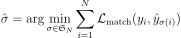
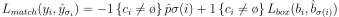
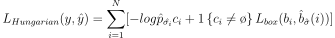

# DETR 阅读汇报

## 论文信息

- 标题：End-to-End Object Detection with Transformers
- 作者 / 会议或期刊：CVPR
- 链接：[https://arxiv.org/abs/2005.12872](https://arxiv.org/abs/2005.12872)

## 一句话概括

DETR 首次将目标检测重构为一个端到端的集合预测问题，通过引入Transformer与匈牙利匹配损失，彻底摒弃了传统检测器中手工设计的anchor、proposal和NMS后处理，实现了概念简洁且性能强大的新范式。

## 方法要点

### 匹配方法

这里涉及二分匹配，即左集合U是N个真实目标，包含空集，右集合V是N个模型预测，希望能找到一个完美匹配，使得总权重最小，这就是最小权二分匹配。常用方法是匈牙利算法。

DETR的输出为N个预测(query slots)，但真实物体数量M << N, DETR重点解决了哪个prediction对应了哪个GT? 传统方法中常用IoU+anchor heuristic，而DETR提出可以直接做全局最优匹配。

DETR首先做出了如下定义，首先定义一组真值：y = {y₁, y₂, ..., y_M}，对应预测值为：ŷ = {ŷ₁, ŷ₂, ..., ŷ_N}，但为了统一，DETR做了一个关键的trick，把GT填充成N个，多余的就用∅填充。然后DETR做了一个σ排列，σ(i) = 第i个GT匹配到哪个prediction，其本质还是GT与Prediction的一一对应关系。接着DETR定义了一个优化目标:



这里表示找到让对应结果最小的哪个方案，这里涉及一个L_match，匹配代价，L_match=分类误差+box误差；具体可以表示为：



其中, GT部分y_i=(c_i, b_i), c_i表示类别，b_i表示bounding box(x,y,w,h)，即检测框；Prediction部分ŷ_j=(p̂_j, b̂_j), p̂_j(c)表示属于某类别的概率，b̂_j是预测框。

而L_match可分为三部分，第一部分，-p̂σ(i)(c_i)是指如果prediction对这个类别很自信，此时p=0.9, cost=-0.9, 反之如果不确定，p=0.2, cost=-0.2, 由于此处是minimize cost, 所以概率越高，对应cost越低，越容易被匹配；第二部分，L_box(b_i, b̂)是用于衡量预测框与真实框的差距，通常包括L1 loss(位置差)以及GIoU loss(形状/重叠)，这里越接近，cost越小；第三部分，指示函数1{c_i ≠ ∅}，作用是只在这个GT对应不是空集时才计算。

这样的方法明显区分于传统方法。例如Fast R-CNN或YOLO，都有其自己的proposal(候选框)，IoU规则，但是设定阈值之后进行区分，总会有出现重复的情况，一个GT对应多个prediction, 结果需要NMS(非极大值抑制)。而DETR使用匈牙利算法，一个GT只对应一个prediction，因此不会出现多个框检测同一个物体的情况，因此不需要后续的NMS。

这里matching不参与梯度传播，但他决定了决策，在所有possible assignment中，选一个最合理的分配。匹配已经确定好之后，模型应该怎么学？这里真正参与梯度传播的是与之对应的损失函数Hungarian Loss。

Hungarian Loss的本质仍然是先分配再监督:



公式中σ̂ = Hungarian matching的结果；

第一项：-log p̂σ(i)(c_i)， 这是标准交叉熵，预测的类别概率越高，对应的损失就越小，这里还加入了条件监督，这里对于匹配到空集的Loss给了0.1的系数，如果不处理可能会让模型全部去预测空集。

第二项: 1{c_i ≠ ∅} L_box, 该项只有在有物体的时候计算，如果是空集就不算box；这里不止有L1 loss, 还有GIoU loss，L1 loss对不同尺度的box不公平，同样|Δ| = 0.02的L1 loss, 小物体的GT: 0.1 × 0.1，预测: 偏差 0.02，相对偏差：0.02 / 0.1 = 20%；大物体的GT: 0.8 × 0.8，预测: 偏差 0.02，相对误差：0.02 / 0.8 = 2.5% 因此引入了GIoU，L1 loss负责精确回归位置，GIoU在IoU基础上引入最小包围框，即使不重叠也能给出距离信息，是区域级指标。

DETR的box loss可写为：L_box = λ_iou * L_iou + λ_L1 * L1

<details>
<summary>Hungarian Matching 匈牙利匹配</summary>

面对一个二分图匹配问题，GT objects ↔ Predictions，如 y₁, y₂, y₃ ↔ ŷ₁, ŷ₂, ŷ₃，现在旨在找一种一一匹配，使总cost最小的匹配方法。但每一对都有一个cost, 就是L_match。如果暴力匹配，若N=100, 可匹配数是100，无法计算。

而Hungarian Algorithm解决了最小权重二分图完美匹配问题，输入一个cost matrix(NxN)，输出一个以一个矩阵形式呈现的最优匹配 σ̂ 

1. 行归一化

```text
每一行减去最小值
y₁: [4 1 3] → [3 0 2]
y₂: [2 0 5] → [2 0 5]
y₃: [3 2 2] → [1 0 0]

得到：
        ŷ₁  ŷ₂  ŷ₃
y₁      3   0   2
y₂      2   0   5
y₃      1   0   0
```

2. 列归一化

```text
每列再减最小值：
        ŷ₁  ŷ₂  ŷ₃
y₁      2   0   2
y₂      1   0   5
y₃      0   0   0
```

3. 用最少的横线/竖线覆盖所有0，如果线的数量=N(这里是3)，就说明可以找到完美匹配

4. 如果线不够 -> 找最小未覆盖值m -> 调整矩阵(未被覆盖的：减m || 被覆盖一次的：不变 || 被覆盖两次的：加m) -> 重复

```text
更新之后：
        ŷ₁  ŷ₂  ŷ₃
y₁      1   0   1
y₂      0   0   4
y₃      0   1   0
```

</details>


### DETR Architecture

DETR实际是三个模块的组合：

```text
Image
  ↓
CNN Backbone
  ↓
Transformer Encoder-Decoder
  ↓
FFN（预测头）
  ↓
Set of objects
```

1. 输入：x_img ∈ R^{3 × H₀ × W₀}，CNN输出：f ∈ R^{C × H × W}（经典：C = 2048，H = H₀ / 32，W = W₀ / 32）. CNN提供局部视觉特征（纹理、边缘、语义）

2. 1x1 卷积降维，考虑到Transformer 的计算复杂度 ∝ d²，不进行降维算力需求过大：C = 2048 → d = 256（通常），得到z₀ ∈ R^{d × H × W}；flatten空间降维，z₀ → R^{d × HW}，每个位置变成一个 token：token_i = 图像中的一个 spatial location，这里DETR将2D feature map → sequence，这个思想和ViT有异曲同工之妙，不谋而合。

3. Transformer Encoder-Decoder: Self-Attention/Cross-Attention + FFN；

encoder部分：这里位置编码和ViT以及传统Transformer都不一样，DETR的positional encoding是z = z₀ + pos不会丢失空间信息，位置编码是2D的。经过多层encoder之后，输出：R^{d × HW}，每个位置都包含“全局上下文信息”，成为一个“全局理解后的 feature map”

decoder部分：这里用N个object一起预测，并行输出，query₁ → object₁ query₂ → object₂同时进行；但结构本身没变。也有self-attention和cross-attention的交叉，这里有cross-attention是为了进行交互；此外，这里由于区分位置信息，初始化query₁, query₂, ..., query_N（随机），同时设定可学习向量，让每个query有不同的偏好，得到不用的object slot。

在 DETR 中，object query 并不是一开始就代表某个具体物体，而是一组随机初始化的向量。例如一张图中有一只猫和一只狗，我们设置 3 个 query（query₁、query₂、query₃），初始时它们只是不同的随机向量，并没有语义。在第一次前向传播中，这些 query 通过 decoder 的 cross-attention 去“观察”整张图，但由于尚未训练好，它们可能都会同时关注猫和狗，输出的 prediction 也是模糊、不确定的。

关键在于接下来的 Hungarian matching：模型会根据预测结果，将 query₁ 分配给猫、query₂ 分配给狗、query₃ 分配给空（∅）。随后通过 loss 反向传播，query₁ 被迫学习“更像猫”、query₂ 学习“更像狗”，而 query₃ 学习“不对应任何物体”。随着训练不断进行，query₁ 会逐渐专注于猫所在区域，query₂ 专注于狗，query₃则稳定为背景，从而实现从“随机向量”到“各司其职的 object slot”的分化过程。

举个例子：首先设定图中有两个物体，猫在左侧，狗在右侧。设定N=3(3个query), 经过随机初始化(包含encoder)已经不一样：

```text
query₁ = [0.12, -0.3, ...]
query₂ = [-0.8, 0.5, ...]
query₃ = [0.01, 0.02, ...]
```

第二步进入decoder，cross-attention会让每个query都会去看整张图，query₁：注意力：40%看猫 + 60%看狗；query₂：注意力：50%猫 + 50%狗；query₃：注意力：30%猫 + 70%狗。此时所有 query 都在“乱看”，输出prediction:

```text
ŷ₁：模糊的东西
ŷ₂：模糊的东西
ŷ₃：模糊的东西
```

到了关键一步：Hungarian matching。此时GTy₁=cat, y₂=dog; 预测ŷ₁更像猫，ŷ₂更像狗，ŷ₃都不像，那么Hungarian matching的结果为：

```text
query₁ → cat
query₂ → dog
query₃ → ∅
```

接下来，反向传播，真正让query分化，对query₁（负责 cat）loss会逼它更像 cat，结果就是query₁学会“关注猫的区域”；对query₂（负责 dog）query₂学会“关注狗的区域”；对query₃（∅）query₃学会“不要预测物体”。第二轮forward时，就开始产生分化，query₁：注意力：80% 猫 + 20% 狗；query₂：注意力：20% 猫 + 80% 狗；query₃：注意力：很分散（不专注），最后的结果就是: ŷ₁：更像 cat, ŷ₂：更像 dog, ŷ₃：∅ 

继续训练的结果就是query₁：只看猫 → 专门负责猫，query₂：只看狗 → 专门负责狗，query₃：学会“空”。总结来讲，DETR随机初始化多个 slot → 用 matching 分配任务 → 用 loss 强制 specialization


**这里和ViT高度相似但又存在差异：1. ViT的图像patch使用CNN，但kernel_size=步长，Conv(kernel = patch_size, stride = patch_size)，只是切patch，没有彼此的特征融合，但DETR是用的ResNet标准CNN, 已经有了信息的提取与世界的理解能力。2. ViT的位置编码是可学习的1D位置编码，但DETR = 2D positional encoding，pos(x, y) = pos_x(x) + pos_y(y)。3. ViT没有decoder，它主要实现的是Image → Encoder → CLS token → 分类，本质是many -> one(整个图 -> 一个标签)，但DETR实现Image → Encoder → Decoder → 多个 object，本质是many → many(图 -> 多个object)，这里引入 object queries，有对应的query₁, query₂, ..., query_N，每个query要从 encoder feature 中“提取一个 object”，因此，有decoder，Decoder = object extractor，encoder重在理解，decoder重在生成/查询。**

模型最终会输出 object query = 一组“可学习的向量”，本质就是一组参数，query 不是预测结果，而是模型内部的“输入信号”。每个 query 输出一个 object prediction。DETR的本质是用一组slot去解释场景。object query = 一组可学习的“找物体的槽位（slot）”，它不是预测，而是生成预测的“起点”。这里的query不是之前谈到的匹配方法中进行二分匹配的对应的N个预测，这里query是一个隐藏向量，没有类别概率，没有box,;是经过了FFN之后，query会输出为prediction，得到对应的(class probability, box);这个prediction才是与GT进行二分匹配的。

### auxiliary decoding losses 辅助损失

DETR不仅在最后一层算 loss，而是在每一层 decoder 后都算 loss，也就是：

```text
Decoder Layer 1 → loss  
Decoder Layer 2 → loss  
...  
Decoder Layer L → loss（最终）
```

每一层都有：FFN → prediction → Hungarian matching → loss；如果只在最后一层监督，query 需要经过很多层才知道自己该干嘛，很难进行纠正；而加了auxiliary loss会逐步变好。

## 一些想法

DETR 的主要优点在于它提出了一种端到端的目标检测范式，将传统检测器中复杂的组件（如 anchor 设计、NMS 后处理等）全部移除，直接将检测问题建模为集合预测问题（set prediction）。通过引入 Transformer 和 object query，模型能够进行全局建模，并显式学习物体之间的关系，同时借助匈牙利匹配实现一对一分配，避免重复检测。这种设计结构简洁、思路统一，也为后续的 object-centric 表示学习和 slot-based 方法提供了重要启发。

不过，DETR 也存在一些明显不足。首先，其训练收敛速度较慢，需要较长时间才能学到有效的 query 分工，这与其全局 attention 和匹配机制有关；其次，在小目标检测上表现较弱，因为特征分辨率较低且缺乏多尺度机制；此外，固定数量的 query 也可能带来一定冗余。正因为这些问题，后续工作在加速收敛、引入多尺度特征等方面进行了改进。

## 相关工作
[DETRsBeat YOLOsonReal-time Object Detection](https://arxiv.org/abs/2304.08069)

[RT-DETRv2: Improved Baseline with Bag-of-Freebies for Real-Time Detection Transformer](https://arxiv.org/abs/2407.17140)