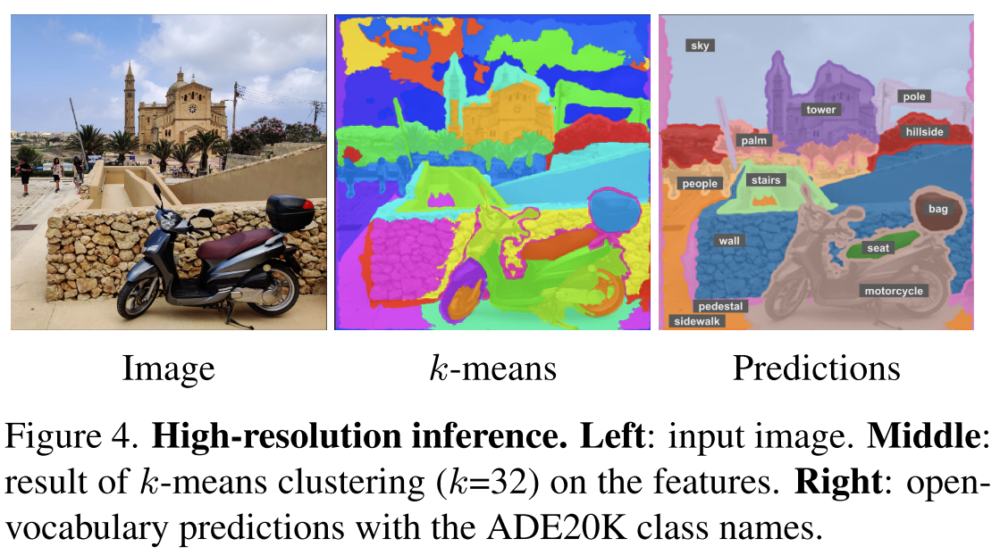
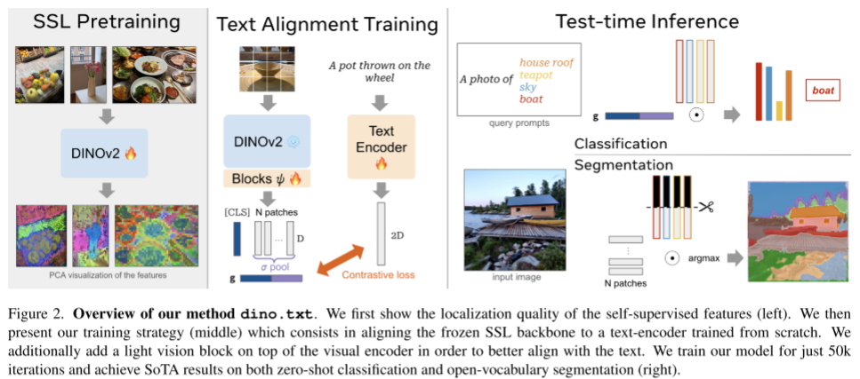

# DINO+TEXT 阅读汇报

## 论文信息

- 标题：DINOv2 Meets Text: A Unified Framework for Image- and Pixel-Level Vision-Language Alignment
- 作者 / 会议或期刊：CVPR
- 链接：[https://arxiv.org/abs/2412.16334](https://arxiv.org/abs/2412.16334)

## 一句话概括

提出了dino.txt的方法，从LiT的经验中获得灵感，结合DINOv2与开放词汇检测，实现了零样本分类与开放词汇语义分割任务的对齐任务中最先进的性能指标。

## 方法要点

### 背景

像DINOv2这样的自监督视觉基础模型非常强大，它们能够生成通用的特征，这些特征在各种下游任务上表现优异，而且使用方法简单高效，通常只需要接一个线性层，无需昂贵的微调，就能够轻易适配。DINOv2能够在捕捉图像的全局上下文的同时捕捉局部信息，所以从图像分类到语义分割、物体匹配、追踪等多种任务上都取得了SOTA成果。

但是尽管其视觉能力强大，但这些自监督模型没有与语言进行对齐，这严重限制了它们在开放词汇场景中的应用。我们知道如CLIP这样的图文对齐的多模态模型在展现了卓越的能力，如今强调可提示的时代，这是一个亟需解决的问题。作者在DINOv2的基础上，希望设计一个语言接口，通过将DINOv2的特征空间与语言进行对齐。

类似CLIP的方法尽管从头联合训练视觉和文本编码器，使其在共享空间中对齐，但对于小规模算力，计算成本极为高昂，而作者借助LiT的思想，通过冻结图像层，仅训练文本部分，来解决开放词汇的识别任务，这使得在保留视觉编码器的良好特性的同时也让文本进行了对齐。好处是显而易见的，一方面保证效果极佳的视觉编码器不会被后续的数据集污染，另一方面节约了极大的计算成本。

尽管LiT提供了很好的思路，但是实际应用时仍然出现了一些问题，尤其在需要细粒度细节的任务上，如语义分割/图文检索中，这里主要有两个根本原因，一个是全局对比学习范式的局限性，LiT只对比全局图像和文本表示，难以生成高质量的密集特征，而这对于像素级任务至关重要；第二个问题可能影响更大，冻结的DINOv2是在其自己的预训练数据上训练的，而LiT的图文对齐训练使用的是另一套数据（通常是网络爬取的图文对），这种差异会阻碍有效的对齐。

本文中提出了三个核心解决方案：

> 对于问题1，增强视觉表示：放弃仅使用[CLS]的方法，而是将[CLS]与所有图像块的平均池化结果进行拼接，这一点沿袭了DINO中的思路。

> 对于问题2，引入可学习的视觉适配器：在冻结的DINOv2编码器之上，添加两个可学习的视觉模块，允许视觉特征能够适应新的LiT训练数据，有效弥合预训练数据和对齐训练数据之间的差距

> 改进数据集质量（这一点我无能为力）

### 相关工作的关联

1. 确立视觉主干（2025 DINOv2）的技术来源和先进性。

2. 界定本文将CLIP确立为图文对齐的基石，明确声明了本文不采用复杂的改进，而是回归最朴素的LiT范式，冻结视觉编码器，仅训练文本编码器，使用原始对比损失，表明其性能提升并非来自昂贵的计算或复杂的算法，而是源于巧妙的架构设计。

3. 在开放词汇语义分割任务背景下，本文属于训练优化型(优化得到patch token的过程)而非后处理型(CLIP的patch token应用)，使用粗粒度标注路线，主张用小体量的资源，得到全局与局部的权衡(冻结的图像编码器关注全局+文本对齐局部)

### dino.txt的具体实现

1. 原始的图像文本的对齐方式

（1）图像文本编码器：这里**视觉编码器**是一个冻结的ViT(DINOv2)的结构，输入图像3xHxW, 被切成N个patch，输出包含[CLS], ϕV​(I)=[c,f1​,f2​,…,fN​]，[CLS]是全局语义，fp是每个patch的局部语义，但是这里选择了DINOv2，patch 特征fp本身就有非常强的结构感知特征。这里冻结视觉编码器，不破坏DINOv2已经学到的结构，所有的语言对齐能力必须由文本encoder去适配视觉空间，这个也是经典的LiT思路。**文本编码器**部分正如前面所说，是一个从零训练，然后投影到视觉空间的过程，整体上看先是一个Transformer encoder，但是最后一层Linear是把文本embedding映射到和图像同一个维度D，这里也是最关键的一点：文本encoder是从scratch训练的，就是意味着没有使用BERT预训练，语言语义是被视觉空间塑造的，换句话说，不是image->text，而是text->image的结构空间。这里简单理解就是让语言去适配一个具有空间结构的视觉场。

（2）用[EOS]对齐[CLS]：这里图像是用[CLS]，文本是用[EOS]做对齐：align(c,tEOS​)；但是这里实际是在做全局对齐，后续会将这种全局对齐扩展到像素级别。

2. 改进的图像文本对齐方法

（1）困境：如果只有[CLS]进行对齐，有点在于全局语义强，分类效果好，但是patch完全没被训练到，做分类时完全不适用；而如果使用patch pooling的方法，使用图像的patch token，这就破坏了模型整体的语义表达能力。因此，实际上实现全局对齐和局部对齐是矛盾的，很难同时兼顾。

（2）改进：作者希望构建一个同时包含全局和局部特征的联合表示，然后再去对齐text。作者提出了两步改进：**Step1**,先对视觉特征做轻微的可学习调整，原本是[c,f1​,...,fN​]，然后加了两层可学习的transformer: ψ([c,f1​,...,fN​])=[c′,f1′​,...,fN′​]。这个ψ的作用不是重新学习视觉，而是在不破坏DINOv2的前提下，让特征平滑的与文本进行对齐。这里DINO是的结构来源，而ψ是一个对齐调节器。**Step2**,构造一个新的全局描述g，这也是最核心的公式：g=[c′;σ(f1′​,...,fN′​)]，也就是进行了一个拼接操作，c'是CLS（全局语义），σ(...)是patch的average pooling（局部汇总），这里不是替代，而是二者并存，得到的g是一个2D维度的联合编码。每个patch都被迫为全局语义负责，但又不同于最大池化那样让最强大的patch起作用，减少了不稳定的因素；通过这种方式就把全局对齐的工作均匀分配到了所有的patch。同时这里使用拼接而不是加法，避免两种方法的干扰。

g=[c′;σ(f1′​,…,fN′​)],σ=average pooling对于梯度的影响：对于损失而言L(g,text)，也就是loss只直接作用在g上，这是一个全局描述，而通过链式法则，在修改之后的g中，对于损失求关于patch token(fn')的梯度，对应是一个不为0的数，而且每个patch都会受到一份均匀分配的梯度。这里如果只用CLS，那么对于patch将完全无法学到任何和text对齐相关的东西；而如果用最大池化，则只有最大的那个patch有梯度，不稳定。

此外，这里的维度值得注意，这里输入的维度是(1+N)xD共1+N个token对应的D个维度，经过transformer的调节器后维度不变，然后经过平均池化后，NXD个维度变成一个D维的向量，接着进行拼接得到一个2D维度的向量

3. 对比式的图文匹配方法

图像产生g=[c';σ(f′)]，文本产生tEOS​，训练目标设定为让匹配的(iamge, text)更接近，不匹配的更远，这个就是标准的对比学习。

## 一些想法

是不是可以和deformable detr里面的可变形Transformer的思想结合一下？

