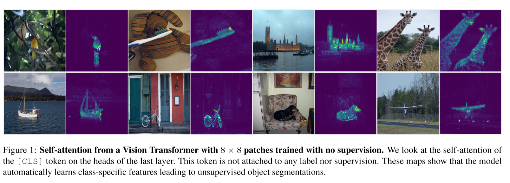

# RTDETR 阅读汇报

## 论文信息

- 标题：Emerging Properties in Self-Supervised Vision Transformers
- 作者 / 会议或期刊：ICCV
- 链接：[https://arxiv.org/abs/2104.14294](https://arxiv.org/abs/2104.14294)

## 一句话概括

受到ViT的class token的注意力结果启发，提出的一种自监督学习框架，提出自监督学习与ViT架构的结合，不仅能产生强大的通用视觉表征，还能激发出 ViT 独有的、类似“对象意识”的能力

## 方法要点

### 思维启发来源

上图很好的展示了 DINO 的灵感来源，这张图展示了在没有人工标注情况下，ViT的class token([CLS])的自注意力图本身就可以隐式的学习到物体的语义边界，从而实现高质量的、无需任何标注的物体分割，这是通过自监督方式训练的结果。虽然 [CLS] token 本身是一个无空间位置的全局向量，但在 Vision Transformer 的最后一层，它会通过自注意力机制计算自己对每个图像块（patch）token 的关注度——即生成一组标量注意力权重；由于这些 patch token 在输入序列中严格按图像空间顺序排列（如从左到右、从上到下），我们可以将 [CLS] 对应于各 patch 的注意力权重重新排列（reshape）成与原始图像网格一致的二维热力图；这张热力图直观地反映了 [CLS] 在做全局表征时“聚焦”于图像的哪些区域，而 DINO 论文发现，在自监督训练下，这种聚焦恰好高度集中在语义物体上，从而涌现出无需标注的物体分割能力。这种能力不是人物设计的，而是通过自然涌现的。

究其原因可以分为4个点：第一是自监督目标驱动语义一致性，DINO的目标是让不同增强试图下的特征一致，为了做到这一点，模型必须理解“同一物体”的概念，而忽略背景噪声的影响，这迫使模型学习对象级的不变表示；第二是由于ViT的全局建模能力，其具有全局交互能力，class token作为全局汇总节点，很容易能看到整个物体的完整结构；第三个是8x8的patch提供了丰富的空间细节，可以精准定位与分割；第四是因为无监督目标避免了类别的偏执，模型不会被“猫=毛茸茸+四条腿”的先验舒服，而是更纯粹的学习视觉显著性与结构一致性，能更具有泛化性。

对于监督学习，应该进行如下区分：

> 有监督学习使用人工标注的明确标签（如类别、边界框）作为监督信号；

> 自监督学习从数据本身构造监督信号（如预测被遮盖的部分、对比不同增强视图），无需任何人工标签；

> 弱监督学习则利用不完整、不精确或间接的标签（如图像级标签代替像素级标签、自然语言描述、标签噪声等）进行训练。

简单来说就是：有监督靠人标，自监督靠自己造任务，弱监督靠“粗糙”或“间接”的标签。

以ViT为模型架构举例：
| 方法/模型 | 模型架构 | 训练范式 | 是否需要人工标签？ | 监督信号来源 |
|----------|--------|--------|------------------|------------|
| 原始 ViT (2021) | ViT | 有监督 |  是 | ImageNet 类别标签 |
| DINO | ViT | 自监督 |  否 | 图像自身增强视图 |
| MAE | ViT | 自监督 |  否 | 被遮盖的图像块 |
| CLIP | ViT（图像编码器） | 弱监督/多模态 | （无需分类标签） | 配对的自然语言文本 |
| YOLOv8 | CNN 或 Hybrid | 有监督 |  是 | 边界框 + 类别标签 |

作者在abstract部分提出两大关键发现：**1.显式的语义分割信息：通过自监督学习训练的 ViT，其内部特征天然地包含了用于语义分割的明确信息。这种能力在有监督训练的 ViT 或任何卷积网络中都不明显或不存在。2.卓越的 k-NN 分类性能：这些自监督学到的特征质量极高，甚至可以直接用作k-近邻（k-NN），在 ImageNet 上达到了 78.3% 的 top-1 准确率（使用小型 ViT）。**

本文实现了一个self-**di**stillation with **no** labels(DINO)的自监督方法，并解释为一种无标签的自蒸馏方法，其中最关键的技术有三个：动量编码器、多裁剪训练策略以及在ViT中使用小尺寸图像块。

### 相关工作

1. Self-supervised learning 自监督学习

早期方法主要围绕实例判别，将每一张图片当作一个独立的类别，目标是让模型能区分任意两张不同的图，这里实现的方法是对同一张图做不同的数据增强，得到两个视图，要让模型认为它们相似，而对其他图认为不相似。这样做到的缺点是计算和开销巨大，无法扩展；进而有人提出了对比学习，其核心思想就是不再做分类，而是取比较特征维度之间的相似度，只要拉近正样本对，推开负样本对就行。

最新研究发现，其实根本不需要负样本，也不用区分不同图像，BYOL是里程碑式的工作，同一张图的两个增强视图分别经过两个网络，强制它们的输出特征尽可能一致就可以了，不用负样本，甚至后面发现两个网络完全对称时也可以工作，即只匹配正样本。

这里提到的BYOL，是Deepmind在2020年提出的自监督学习方法，它的工作流程很有趣，它通过两个神经网络，一个在线网络和一个目标网络。在线网络主要负责训练对象，通过梯度反向传播正常更新；而目标网络提供目标特征，不通过梯度更新，而是用在线网络的动量滑动平均进行更新，简单的说就是两者结构完全相同，参数更新的方式不同。

假设现在有一张原始图像x，步骤1：数据增强，对x做两次不同的增强，比如随机裁剪或色彩抖动得到两个视图：x₁ = Augment(x)，x₂ = Augment(x)；步骤2：双分支前向传播，把 x₁ 输入 online 网络 → 得到特征 z₁，把 x₂ 输入 target 网络 → 得到特征 z₂_target，当然也可以反过来（x₂ 进 online，x₁ 进 target），通常会做对称 loss；步骤3：在线网络网络后面接一个预测头（predictor，一个小 MLP）输出：q₁ = predictor(z₁)，目标网络网络后面只有投影头（projector，无预测头）输出：z₂_target；步骤4：计算损失，用MSE进行匹配，目标是让q₁ ≈ z₂_target（归一化后的向量）；步骤5：参数更新，在线网络网络（含预测头）：通过上述 loss 计算梯度，正常反向传播更新，目标网络网络不参与梯度计算！它的参数按如下方式更新：θtarget​←0.99⋅θtarget​+0.01⋅θonline

目标网络的滑动平均更新是相对较慢变化的过程，可以消除随机性，同时可以提供一个稳定的表示；预测头的存在防止了系统的表征坍塌，他要去拟合一个动态变化的目标

在前人基础上，主要是受到BYOL的启发，作者用了不同的相似性匹配损失函数，同时设定学生和教师网络结构完全相同。

## 一些想法

## 相关工作

[DINOv2: Learning Robust Visual Features without Supervision](https://arxiv.org/abs/2304.07193)