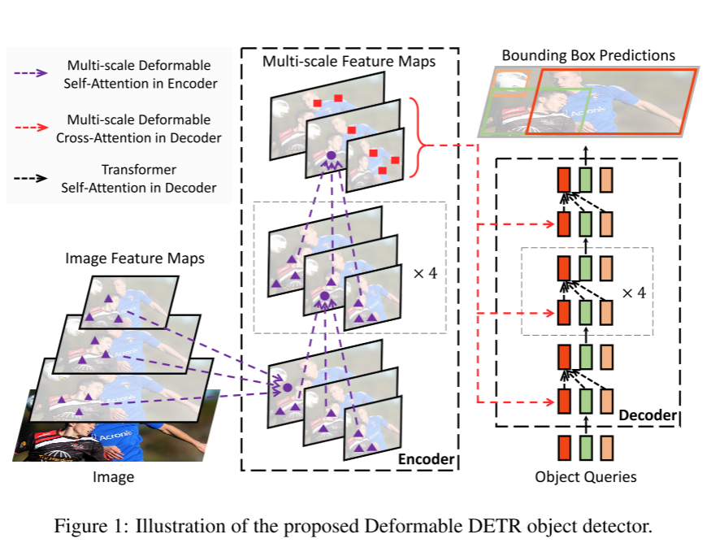
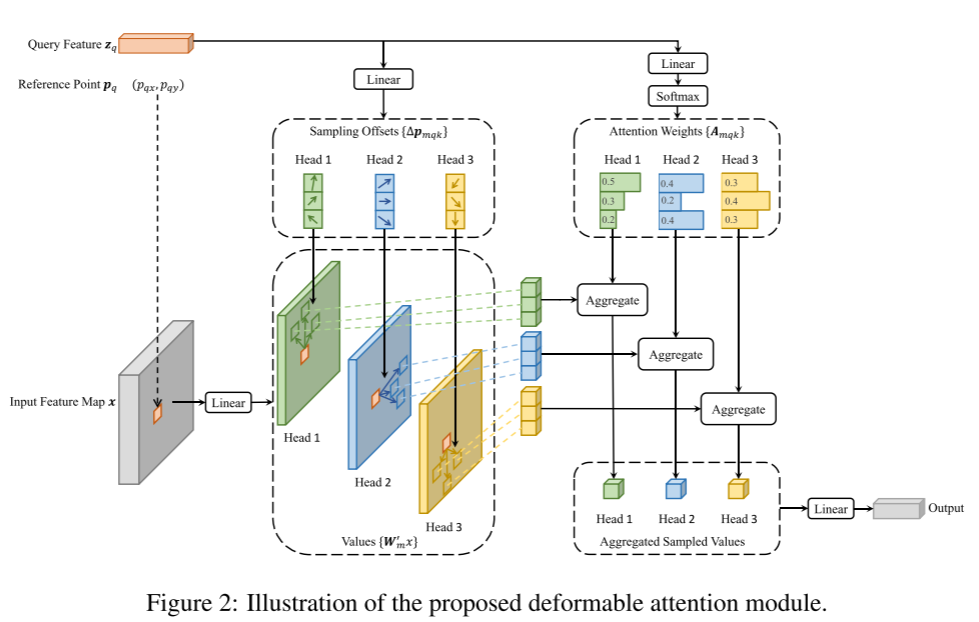

# Deformable DETR 阅读汇报

## 论文信息

- 标题：DEFORMABLE DETR:DEFORMABLE TRANSFORMERS For End-to-End Object Detection
- 作者 / 会议或期刊：ICLR
- 链接：[https://arxiv.org/abs/2010.04159](https://arxiv.org/abs/2010.04159)

## 一句话概括

提出了deformable attention模块，打破传统注意力机制的边界

## 方法要点

### Deformable Attention

这篇文章需要重点关心的其实就是一个点，Deformable Attention的提出与应用。

对于普通的Transformer而言attention时，计算量时O(N²)，每个query会对整张feature map做全局注意力，导致收敛较慢，小物体检测差。而Deformable Attention的核心思想就是不看全图，只关注少数几个关键位置。在DETR中应用时就是每个query只关注K个采样点(sampling points)而不是整个feature map。

Deformable Attention对每个query做三件事：1.预测reference point; 2.在reference point周围采样K个点；3.对这些点做attention加权。通过上述方式实现了从密集到稀疏的变化，降低了复杂度；同时引入显示几何结构，利用空间先验；并融合了多尺度信息，不同尺度的特征图上都会采样点，解决了目标大小对应尺度不同的问题。




### 代码实现

```python

class MultiScaleDeformableAttention(nn.Module):
    def __init__(self, dim, num_heads=8, num_levels=4, num_points=4):
        super().__init__()

        self.dim = dim
        self.num_head = num_heads
        self.num_levels = num_levels
        self.num_points = num_points

        self.head_dim = dim // num_heads
        assert dim % num_heads == 0, "dim must be divisible by num_heads"

        self.sampling_offsets = nn.Linear(dim, num_heads * num_levels * num_points * 2)
        self.attention_weights = nn.Linear(dim, num_heads * num_levels * num_points)

        self.value_proj = nn.Linear(dim, dim)
        self.output_proj = nn.Linear(dim, dim)


    def forward(self, query, multi_scale_feats, reference_points):
        """
        query: (B, Nq, D)  query是decoder的输入, Nq是query的数量, D是特征维度
        multi_scale_feats: list of feature maps 多尺度特征图，每个: (B, C, H_l, W_l)
        reference_points: (B, Nq, num_levels, 2)  # normalized [0,1]    每个query在每个尺度上的参考点位置，归一化到[0,1]范围内，最后一个维度是(x,y)坐标
        """
        # 得到输入的batch size和query数量
        B, Nq, _ = query.shape

        # 计算采样偏移和注意力权重
        sampling_offsets = self.sampling_offsets(query)
        sampling_offsets = sampling_offsets.view(
            B, Nq, self.num_heads, self.num_levels, self.num_points, 2
        )
        attention_weights = self.attention_weights(query)
        attention_weights = attention_weights.view(
            B, Nq, self.num_heads, self.num_levels * self.num_points
        )
        attention_weights = F.softmax(attention_weights, dim=-1)
        attention_weights = attention_weights.view(
            B, Nq, self.num_heads, self.num_levels, self.num_points
        )

        # 初始化输出
        output = torch.zeros(B, Nq, self.num_heads, self.head_dim, device=query.device)

        # 遍历每个尺度的特征图进行采样和加权求和
        # lvl 是当前处理的特征层级的索引 feat 是当前的特征图(B,C,H,W)
        for lvl, feat in enumerate(multi_scale_feats):
            B, C, H, W = feat.shape

            # (B, C, H, W) -> (B, num_heads, head_dim, H, W)
            # 将C进行拆分
            feat = feat.view(B, self.num_heads, self.head_dim, H, W)

            # 取 reference point
            # 获取当前层级的lvl层的参考点，插入两个维度None以匹配偏移量的shape，便于广播相加
            # reference_points: (B, Nq, num_levels, 2) 中每个query在每个尺度上的参考点位置，归一化到[0,1]范围内，最后一个维度是(x,y)坐标
            # (B, Nq, 1, 1, 2)
            # 这个已经是取值之后的结果，取的值就是第lvl维度的结果
            ref = reference_points[:, :, None, lvl, None, :]

            # 去除当前的层级的所有偏移量
            # 上一步的sampling_offsets的完整形状是(B, Nq, num_heads, num_levels, num_points, 2)
            # B: Batch size Nq: Query 的数量 num_heads: 注意力头的数量 num_levels: 特征图的尺度数量（例如 4 个：P3, P4, P5, P6） num_points: 每个注意力头在每个尺度上采样的点数（例如 4 个） 2: 每个采样点的偏移量 (Δx, Δy)
            # [:, :, :, lvl] 是对 sampling_offsets 的前四个维度进行切片，但lvl是具体的数，当我们用一个具体的索引（如 lvl=0）去索引一个维度时，该维度会被“挤压”（squeeze）掉。
            # (B, Nq, num_heads, num_points, 2)
            # 这个已经是取值之后的结果，取的值就是第lvl维度的结果
            offset = sampling_offsets[:, :, :, lvl]  
            

            # 计算采样点位置（归一化到 [-1,1]），offset/(w,h)，都统一到归一化单位之下
            sampling_locations = ref + offset / torch.tensor([W, H], device=query.device)
            # 将坐标映射到[-1,1]
            sampling_locations = sampling_locations * 2 - 1

            # reshape for grid_sample
            # 重塑之后对应：(batch*特征头数量，query数量*采样点，1，2)
            # 这里1对应W_out
            # 这里2就是对应的xy坐标
            sampling_locations = sampling_locations.view(
                B * self.num_heads, Nq * self.num_points, 1, 2
            )
            
            # 对特征图做相关的处理，原feat中的C被分成num_heads * head_dim, 然后在这里再融合
            feat = feat.view(B * self.num_heads, self.head_dim, H, W)

            # 在每个 head 的特征图上，在 Nq * num_points 个位置（由 sampling_locations 指定）进行双线性插值采样。
            sampled = F.grid_sample(
                feat,
                sampling_locations,
                mode='bilinear',
                align_corners=False
            )  # (B*num_heads, head_dim, Nq*num_points, 1)

            # 把采样结果重组回“按 query 组织”的格式，用于后续注意力加权
            sampled = sampled.view(
                B, self.num_heads, self.head_dim, Nq, self.num_points
            ).permute(0, 3, 1, 4, 2)  # (B, Nq, num_heads, num_points, head_dim)

            # 去注意力权重
            attn = attention_weights[:, :, :, lvl].unsqueeze(-1)
            # 输出
            output += (attn * sampled).sum(dim=3)
        # 回到初始的维度
        output = output.view(B, Nq, self.dim)

        return self.output_proj(output)

```

## 一些想法

妙啊！