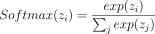
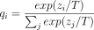
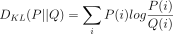

# Distillation 阅读汇报

## 论文信息

- 标题：Distilling the Knowledge in a Neural Network
- 作者 / 会议或期刊：NeurlPS
- 链接：[https://arxiv.org/abs/1503.02531](https://arxiv.org/abs/1503.02531)

## 一句话概括

提出了知识蒸馏的通用方法

## 方法要点

### 方法引入

```text

很多昆虫（比如蝴蝶）都有两种截然不同的生命形态：幼虫阶段，它的唯一任务就是吃！吃！吃！它的身体结构就是为了能够高效地从环境中吸收能量和营养。但是成虫阶段它的任务完全改变，是为了飞行、寻找配偶和繁殖，它的身体结构如翅膀等就是为了满足这些新需求而优化的

```

作者指出，在传统的机器学习中，训练阶段和部署阶段用的是几乎一模一样的模型，这可能是一个错误，因为这两个阶段的需求天差地别。训练阶段的目标是从海量冗余的数据中提取出数据的内在结构和规律，不要求实时性，可以花几天甚至几周，计算资源非常奢侈，可以用成百上千块的GPU；但是在部署阶段目标改变，是要为大量用户提供快速实时的预测服务，对延迟和计算资源有极为严苛的要求。

因此，我们在机器学习中我们也应该使用类似“幼虫”的模型来进行训练，因为这种模型能更有效的消化海量数据，从中榨取最有价值的知识，无论是模型集成（即多个独立训练的大模型）还是单个超大模型（比如使用了Dropout等强正则化的巨大神经网络），先把模型训练好，然后通过蒸馏，将笨重模型学到的所有知识转移到一个小巧高效适合部署的“成虫”模型中。

### 对模型迁移/蒸馏的重定义

作者提出，从大模型到结构不同的小模型，就算具体的参数值会不一样，但是知识的本身，不是参数本身，而是让模型所学到的从输入到输出的映射关系，只要小模型能学会和大模型几乎一样的映射关系，那么它就拥有了同样的知识，无论它的内部参数长什么样。此外，这个映射关系的精髓不仅在于正确答案，更在于错误答案之间的相对概率关系，错误答案揭示了数据内在结构和泛化能力。

**知识蒸馏的核心，就是要让小模型学会模仿这个完整的概率分布，而不仅仅是硬标签。**

蒸馏是应用的软目标，而非硬目标。传统训练中的硬目标，例如[0, 0, 1, 0]，表示第3类是正确答案，而蒸馏训练用的是软目标，如[0.1, 0.2, 0.6, 0.1]。蒸馏可以用之前的训练集，也可以用大模型已经打上高质量标签的迁移集。

蒸馏的小模型仅需要更少的数据：因为每个样本的信息量巨大，小模型不需要看那么多数据就能学会，同时可以用更高的学习率：因为梯度噪声小，训练过程更稳定，可以大胆地用大学习率加速收敛。此外其梯度更稳定，在传统训练中，不同样本的梯度方向可能差异巨大（比如一个样本说“肯定是猫”，另一个说“肯定是狗”），导致训练不稳定，而“软目标”的梯度更平滑、更一致，因为它们都来自同一个“老师”的温和判断。相对而言，其信息量也更大，硬目标”只有1 bit的信息（哪个是对的），而软目标”是一个概率分布，熵（Entropy）很高，意味着它包含了关于所有类别之间关系的丰富信息。一个样本就能告诉小模型很多东西。

### 蒸馏

传统的softmax形式为：



所谓蒸馏，就是通过提升温度，让隐藏在极小概率中的暗知识更容易被学生学习，Hinton引入了温度参数，通过在Softmax中加入温度T, 软化教师的输出概率，得到“软标签”。其计算公式为：



这里zi是网络在 Softmax 层之前的原始输出，当 T=1 时，这就是标准的 Softmax 函数；当 T > 1 时，整个概率分布会变得更加平滑（熵更高），原本差异悬殊的概率值会被拉近。这就像将一块坚硬的知识（Hard Label）慢慢加热，使其熔化成流动的液态（Soft Label），其中的复杂结构和内在联系得以充分展现；当 T → ∞ 时，概率分布将趋向于均匀分布。可以发现，随着温度T的升高，教师模型的输出概率分布如何从尖锐变得平滑，从而让负标签中的“暗知识”更容易被学生模型学习。通过这种方式，学生模型能够从一个更“宽容”、信息更丰富的教师信号中学习，从而更有效地吸收其知识。

```text

假设logits：cat = 10, dog = 2, fox = 1
T=1时—>[0.999, 0.000..., 0.000...]几乎只能看见猫
T=10时->[0.5, 0.3, 0.2]可以发现，“狗也有点像”，“狐狸也有一点相关性”

```

这里最关键的点就是高温度 = 暴露“类别之间的相似关系”，这就是蒸馏真正传递的知识

其中最核心的部分就是其对应的损失函数，这个总损失是两个关键部分的加权和：Total Loss = α * L_distill + (1 - α) * L_student，这里的α是一个超参数，用于平衡两个损失项的重要性。两个loss分别是：学生损失L_student以及蒸馏损失L_distill

1. 学生损失部分是基于真实标签的标准交叉熵损失，是标准监督学习的支柱，确保学生模型具备独立解决问题的能力，它所衡量的是学生模型的最终预测（在温度 T=1 下）与数据集中给出的真实“硬标签”之间的差距。通常使用标准的交叉熵（Cross-Entropy）损失。对应Lhard​=CrossEntropy(qstudent,y)，学的是正确答案是谁。

2. 蒸馏损失是基于软目标分布的交叉熵损失，这是其灵魂所在，是学生模型的软预测和教师模型的软标签这两个复杂的概率分布之间的举例，这两个软输入都是在相同的较高的温度T>1下进行计算得到的，Lsoft​=CrossEntropy(qstudent,pteacher)，学的是类别之间的关系。

实践表明，对软目标损失赋予更高权重通常能够获得更优性能，这表明教师模型提供的结构性信息在知识迁移过程中具有主导作用。此外，由于软目标所产生的梯度幅值与温度平方成反比，为了在不同温度设置下保持各损失项贡献的相对稳定性，需要对软目标对应的梯度进行T^2的缩放补偿

进一步地，论文通过对蒸馏过程中梯度形式的分析揭示了一个重要性质：在高温度极限下，蒸馏过程可以近似等价为对教师模型与学生模型 logits 的均方误差最小化。具体而言，当温度远大于 logits 的数值尺度时，softmax 函数可以进行一阶近似，从而使得交叉熵损失的梯度近似与 logits 差值成正比。在对 logits 进行零均值归一化的前提下，该优化目标退化为一个简单的二次函数形式，即最小化学生与教师 logits 之间的平方差。这一结果表明，蒸馏本质上并非仅仅匹配概率分布，而是在更深层次上对模型的未归一化表示空间进行对齐，从而实现知识的结构性传递。

最后，温度参数在蒸馏中的作用不仅体现在分布平滑程度上，还隐含地控制了模型对不同 logits 区域的关注范围。在较高温度下，所有类别的 logits 均对损失产生显著影响，从而鼓励学生模型全面拟合教师模型的输出结构；而在较低温度下，训练过程主要聚焦于概率较高的类别，忽略那些极低概率（即高度负值）的 logits。考虑到这些极端负值往往在教师模型训练中约束较弱、噪声较大，适当降低温度以削弱其影响在模型容量受限的情况下反而可能带来更好的泛化性能。因此，蒸馏温度的选择本质上反映了在“完整结构拟合”与“噪声抑制”之间的权衡，这一权衡通常需要通过经验进行调优。

### 代码实现

```python

import torch
import torch.nn as nn
import torch.nn.functional as F

class DistillationLoss(nn.Module):
    def __init__(self, student_model, teacher_model, T, alpha):
        super(DistillationLoss, self).__init__()
        self.student_model = student_model
        self.teacher_model = teacher_model
        self.T = T
        self.alpha = alpha
        
        # 标准的学生损失，针对硬标签
        self.criterion_student = nn.CrossEntropyLoss()
        
        # 蒸馏损失，使用KL散度
        # `log_target=True` 表示教师输出的是log-probabilities，效率更高
        self.criterion_distill = nn.KLDivLoss(reduction='batchmean', log_target=True)

    def forward(self, inputs, labels):
        # 教师模型推理，不计算梯度
        with torch.no_grad():
            teacher_logits = self.teacher_model(inputs)

        # 学生模型推理
        student_logits = self.student_model(inputs)

        # 1. 计算学生损失 (硬标签)
        loss_student = self.criterion_student(student_logits, labels)

        # 2. 计算蒸馏损失 (软标签)
        # 准备教师的软目标（log-probabilities）
        soft_teacher_targets = F.log_softmax(teacher_logits / self.T, dim=-1)
        
        # 准备学生的软预测（log-probabilities）
        soft_student_preds = F.log_softmax(student_logits / self.T, dim=-1)
        
        # 计算KL散度损失。乘以T*T是为了保持梯度尺度
        loss_distill = self.criterion_distill(soft_student_preds, soft_teacher_targets) * (self.T * self.T)
        
        # 3. 组合损失
        total_loss = self.alpha * loss_distill + (1 - self.alpha) * loss_student
        
        return total_loss

```
其中应用到**KL散度**，这里可以理解为一种衡量两个概率分布之间差异的非对称度量。在信息论中，它刻画的是：当我们用一个分布Q去近似真实分布P时，会“损失”多少信息。因此，它本质上不是一个距离（因为不对称，也不满足三角不等式），而更像是一种“信息代价”。从数学形式上看，KL 散度定义为：



这个公式可以理解为对一个事件i，用P(i)作为权重，去衡量在该位置上Q(i)相对于P(i)的偏差，如果二者一致，则整体散度为0；而一旦Q在某些概率上严重偏离P，这个值就会迅速增大。其实KL模型回答了这样一个问题：如果真实世界遵循分布P，但我们用模型Q来描述它，那么平均而言我们需要多付出多少“额外的信息成本”。在知识蒸馏中，KL 散度的作用非常关键。教师模型输出的是一个概率分布 P（soft targets），而学生模型输出的是另一个分布 Q。通过最小化DKL(P∥Q)，训练过程实际上是在强迫学生模型去“复现”教师模型的概率结构，而不仅仅是预测最可能的类别。此外，KL散度是非对称的，DKL​(P∥Q)≠DKL​(Q∥P)，这在蒸馏中可以理解为将教师分布作为参考标准，而一旦反过来计算，优化目标的行为会发生明显变化。

## 4.16 补充

如果在EMA teacher + centering的情况下，KL还有没有不可替代的作用？

有！KL解决了cos无法解决的概率分布的问题。cos的问题在于只要方向一致，什么分布都行，举一个经典的反例：

```text

teacher(经过centering+sharpening): 
t = [10, 0, 0, 0] 

两个 student：
s1 = [9, 0, 0, 0]     # 正确
s2 = [100, 1, 1, 1]   # 错误

cos:
cos(t, s1) ≈ 1
cos(t, s2) ≈ 0.995（也很高）

但softmax之后，完全不是一个“语义结构”
softmax(s1) → [0.999, ...]
softmax(s2) → [0.7, 0.1, 0.1, 0.1]

KL(s1 || t) → 很小，KL(s2 || t) → 很大，KL 会强烈惩罚 s2

```

KL和cos的本质区别在于KL在约束信息结构，如果没有KL，系统会退化成一个慢慢变化的向量+去均值+方向对齐的功能的系统，陷入模型坍缩的问题。

而在CLIP中不使用KL散度主要是因为跨模态。

## 一些想法

蒸馏的开篇之作！最巧妙的点在于其损失函数的设计以及问题的提出。

## 相关工作

[Emerging Properties in Self-Supervised Vision Transformers](https://arxiv.org/abs/2104.14294)