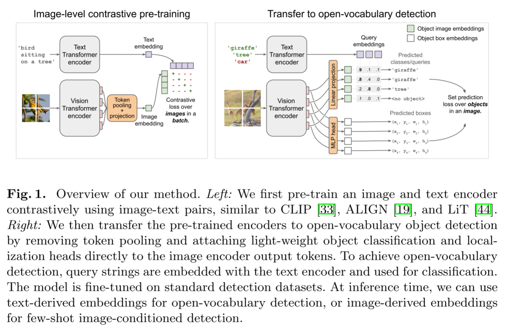

# OWL-ViT 阅读汇报

## 论文信息

- 标题：Simple Open-Vocabulary Object Detection with Vision Transformers
- 作者 / 会议或期刊：ECCV
- 链接：[https://arxiv.org/abs/2205.06230](https://arxiv.org/abs/2205.06230)

## 一句话概括

CLIP + Detection

## 方法要点

OWL-ViT的方法可以分为两个阶段：

1. 图文对比预训练

2. 加检测头 + 微调

### 基础模型设计(从CLIP到开放词汇检测系统的转变)

目标检测是密集预测任务，需要空间感知能力；而ViT的patch tokens由于可学习的positional embedding, 本身就具有位置信息，且覆盖全图。

为了感受全局信息，不止局限于语义，要有位置信息，WOL-ViT移除了class token，保留所有的patch tokends，这样每个token对应输入图像的一个空间区域，独立投影，便于后续分类以及定位。OWL-ViT同样没有decoder部分，用patch tokens + external queries做配对

### 开放词汇对象检测的机制

开放词汇检测的核心机制在于**用文本嵌入代替固定分类头**；即遵循CLIP的原则，将text encoder, 然后每个patch token与文本进行相似度计算。

OWL-ViT通过文本编码实现了类别的多变，且无需重新训练只要能用语言描述就能实现检测，每张图如何查询完全由用户的输入决定。OWL-ViT对query进行独立编码输入，避免相互干扰，便于缓存，更符合原始设定。此外，OWL-ViT和CLIP一样，也没有decoder部分，相对能提升效率。

### 流程图总览



上图展示了OWL-ViT的全过程：

左图的预训练和传统的CLIP接近一致，

```text
image → ViT → 一个 embedding
text  → Transformer → 一个 embedding
→ 做对比学习
```

右图是将预先训练好的架构应用于开放词汇对象检测任务中，这里去除了class token, patch token直接输出并参与训练。

```text
image → ViT → 一堆 token（重点！！！）
text  → Transformer → query embeddings
```

右图一共两个分支：

1. Linear projection(ViT tokens → Linear projection → object image embeddings): 这块主要是分类任务，让每个token对应一个向量，这个向量用来和text embedding比较，然后object embedding ↔ query embedding，得到Predicted classes/queries；比如：

```text
token_1 → "giraffe" 0.9
token_2 → "tree"    0.8
```

2. MLP head(ViT tokens → MLP → box coordinates): 这块主要是做定位，每个token输出(x, y, w, h)，描述的是一个完整的二维框，x,y代表中心点，是相对于整张图的绝对坐标(归一化到 0~1)，w代表宽度，h代表高度。

经过多层的self-attention之后，token_i=所有patch的加权融合，最终token_i≈全图信息+偏重某个区域。**所有token都会预测一个box, 但是只有少数token会被当作有效物体参与训练。**这里具体涉及到了Hungarian matching(匈牙利匹配), 这里的数据集像LVIS、Open Images V4中已经有了GT框，会从中选出n个最合适的，剩余的就变成bg。这里的框是学出来的。

## 一些想法

OWL-ViT没有发明新模块、没有复杂蒸馏、没有两阶段训练；仅仅通过移除 class token + 用文本嵌入作分类头这两个改动，就打通了CLIP到检测的路径。很多人直觉认为图像和文本应该early fusion才能更好对齐，但OWL-ViT主动放弃cross-attention，选择双塔结构，理由非常务实：推理效率>理论上限

## 相关工作
[End-to-End Object Detection with Transformers](https://arxiv.org/abs/2005.12872)
[YOLO-World: Real-Time Open-Vocabulary Object Detection](https://arxiv.org/abs/2401.17270)