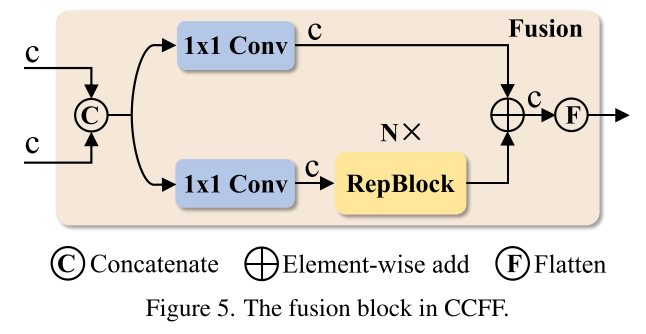

# RTDETR 阅读汇报

## 论文信息

- 标题：DETRsBeat YOLOsonReal-time Object Detection
- 作者 / 会议或期刊：CVPR
- 链接：[https://arxiv.org/abs/2304.08069](https://arxiv.org/abs/2304.08069)

## 一句话概括

在DETR的基础上依靠大规模实验做出的很多改进，一步步找到了改进的方法。所提出的解耦系统以及不确定性判别很有意思。

## 方法要点

### Efficient Hybrid Encoder 高效混合编码器

这部分是解决速度瓶颈的关键所在，在DETR类模型中引入多尺度特征是一个标准做法，因为它能同时利用高分辨率细节和高层次的语义信息，从而加速训练收敛并提升性能。虽然Deformable Attention机制大幅降低了Transformer的计算量，但引入多尺度特征之后，特征图被拼接成一个超长的序列，这个使encoder的消耗成本超过了其精度的提升，投入产出比极低，这就是作者的优化目标。

实际上，高层的信息本就是低层信息的融合，再用一个Transformer去融合，把同尺度和跨尺度操作耦合在一起做，这样效率自然降低，做了很多无用功。作者做了一个解耦的工作：在Variant A的基础上，这里Variant B就是单层的同尺度交互的Transformer Encoder，Variant C是多尺度交互的Transformer Encoder，Variant D及Variant E就是作者的思考与改进。

> A: DINO-Deformable-R50 for experiments and first remove the multi-scale Transformer encoder in DINO-Deformable-R50.

> A → B: Variant B inserts a single-scale Transformer encoder into A, which uses one layer of Transformer block. The multi-scale features share the encoder for intra-scale feature interaction and then concatenate as output.

> B → C: Variant C introduces cross-scale feature fusion based on B and feeds the concatenated features into the multi-scale Transformer encoder to perform simultaneous intra-scale and cross-scale feature interaction.

> C → D: Variant D decouples intra-scale interaction and cross-scale fusion by utilizing the single-scale Transformer encoder for the former and a PANet-style [22] structure for the latter.

> D→ E: Variant E enhances the intra-scale interaction and cross-scale fusion based on D, adopting an efficient hybrid encoder designed by us.

综合来看这个实验思路，作者希望正面把同尺度和跨尺度操作耦合在一起做是低效的，而分开是高效的。首先Baseline(A): 先把所有积木都拿走，看看没有编码器（或者只有最简编码器）的性能；方案1--只用X(B): 我只用X积木块。我把S3,S4,S5(这里分别指不同尺度的特征图，S3分辨率高(e.g.,80x80)，细节丰富，语义弱;S4:分辨率中(e.g.,40x40);S5:分辨率低(e.g.,20x20)，细节少，语义强)各自放进X里处理一遍（同尺度交互），然后把结果拼起来。效果不错，但计算量不大；方案2--用Y(C): 我把S3,S4,S5直接拼起来，然后塞进一个巨大的Y积木块里。Y会试图同时处理所有事情。精度可能略有提升，但计算量暴增！这就是作者要批判的传统做法；方案3--用X+Z(D): 我先用X积木块分别处理S3,S4,S5（同尺度交互），得到三个“深加工”过的特征。然后，我把这三个特征交给Z积木块（PANet）去做跨尺度融合。精度和方案2(C)差不多，甚至更好，但计算量却和方案1(B) 差不多！这就是“解耦”的胜利！最终方案--优化版X+Z(E): 在方案3的基础上，对X和Z都做一些小优化（比如调整通道数、层数等），得到最终的 高效混合编码器。效果：精度最高，速度最快！

**区分一下self-attention, cross-attention, 同尺度交互，多尺度交互: self-attention自注意力机制是qkv的输入就是自己本身，和尺度没关系，是得以让每个位置去感受同一张图其他位置的信息，同时能感受其他位置的信息; cross-attention交叉注意力机制是q,kv分别对应不同的来自decoder/encoder的输入，这是实现查询机制与预测的核心；同尺度交互，指的是同一个分辨率的特征图就独立的应用一个Transformer Encoder层进行输入；多尺度交互，指的是将不同分辨率的特征图进行展平拼接，然后送入Transformer Encoder, 不管多尺度单尺度核心都是self-attention，只是这里包含了多个维度的信息。**

基于上述实验，作者证明了“同尺度交互 + 跨尺度融合”的解耦方案是高效的，因而作者重新设计了编码器的结构并提出了一种由两个模块组成，即基于注意力的同尺度特征交互（AIFI）和基于卷积神经网络的跨尺度特征融合（CCFF）组成的高效的混合编码器。

1. AIFI模块：实现同尺度计算

既然高层特征S5语义最丰富，那就只在S5上做昂贵的 Self-Attention（同尺度交互），而放弃在低层特征（S3, S4）上做！这种方式将计算量降到了最低，这里RT-DETR只取最高层特征S5，将其展平为对应的序列QKV做Transformer, 然后reshape回原来的形状得到F5，该方法实现了AP的不降反升，速度的延迟大幅降低！（全部是实验数据）

2. CCFF模块：实现跨尺度融合

CCFF是对变体D中PANet-style结构的具体化和优化, 是CNN-based跨尺度融合的升级版，图中展示了他的核心单元——Fusion Block



输入：两个相邻尺度的特征，比如 S4 和 F5（或 S3 和 S4）；通道调整：两个输入先分别经过一个 1x1 Conv，目的是将它们的通道数统一为 C（便于后续融合）；主干融合：将调整后的两个特征送入 N × RepBlock（一种重参数化卷积模块，可以在训练时使用多分支结构（如 3x3, 1x1, identity）来增强表达能力，在推理时将其“折叠”成一个标准的 3x3 卷积，从而兼顾性能与速度，这里用 N 个 RepBlock 组成一个小型的“微型网络”，专门负责深度融合这两个尺度的特征）；残差连接：将 RepBlock 的输出与原始输入（经过 1x1 Conv 后的特征）进行 Element-wise Add (⊕)，形成残差连接。这有助于梯度流动，防止信息丢失；输出：得到一个融合后的新特征。

CCFF 并不是一次性把 S3, S4, F5 全部拼起来。它是一个渐进式融合的过程，类似于 PANet，先融合 S4 和 F5 → 得到 F4'，再融合 S3 和 F4' → 得到 F3'，最终输出可能就是 F3' 或者将 F3', F4', F5 都作为后续检测头的输入。

RT-DETR最后通过这两个方式实现了用最少的计算，获得最好的特征表示。用代码表示就是：

```text
Q = K = V = Flatten(S5),
F5 = Reshape(AIFI(Q, K, V)),
O = CCFF({S3, S4, F5}),
```

### Uncertainty-minimal Query Selection 不确定性最小查询

像DETR的工作存在根本性问题，object queries是完全随机初始化，这使得模型训练非常困难且不易收敛，现在的主要方法就是不要随机初始化，而是从encoder输出的特征图中，挑选出K个最有可能包含前景物体，选择标准依靠置信度分数，简单来说：现有方法 = 用一个前景/背景二分类器，选出K个最像前景的点，用它们的特征来初始化Queries。

但是这种方法存在本质漏洞(我都看出来了), 目标检测只用了单一的与分类相关的置信度分数去衡量特征的质量，但是实际上一个好的检测器应包含两个部分，分类以及定位，因此一个特征的真实质量是一个潜在变量，应该同时由分类准确性与定位准确性共同来决定。举一个简单的例子，一个特征可能置信度极高，但是预测的边界框却不准；也有可能边界框很准，但置信度却一塌糊涂。所以这就导致了decoder的好坏参半的起点，导致整个流程效率的下降。

RT-DETR的思路也很简单。核心思想就是用不确定性来衡量特征质量。RT-DETR 的“不确定性”本质上是衡量一个特征点在“分类预测”和“定位预测”上是否“自相矛盾”。它不是直接作为权重加进损失函数，而是反过来——用这个“不确定性”去动态调整（加权）分类损失，让模型更关注那些“言行一致”（即分类和定位都靠谱）的高质量样本。

其不确定性U的本质是利用计算分类置信度和IoU置信度之间的L2范数来实现，他随之会影响损失函数，给每个样本的损失项乘上一个与U相关的权重，对于U小的好样本赋予一个大的权重，让模型重点学习，而U大的坏样本给一个小权重，让模型忽略他，不让他带偏训练。

## 一些想法

RT-DETR在DETR基础上进行了改进：1. 保精度，提速度 —> 关键点在于高效混合的编码器，解耦"同尺度交互"&"跨尺度融合"；2. 保速度，提精度 —> 关键点在于不确定性最小查询选择，给DETR解码器提供了更高质量的初始查询。

通过以上方法RT-DETR很好的超越了当时yolo的性能，目标检测的领域内的确这是很棒的工作！避免了NMS的干扰，同时简约了transformer的冗余结构。不过不能忽视他的不足，RT-DETR仍未实现开放词汇，这一点在其续作中仍未解决，这个工作在Yolo-World中得以实现。

## 相关工作

[RT-DETRv2: Improved Baseline with Bag-of-Freebies for Real-Time Detection Transformer](https://arxiv.org/abs/2407.17140)