# Transformer 阅读汇报

## 论文信息

- 标题：Attention Is All You Need
- 作者 / 会议或期刊：NeurIPS
- 链接：[https://arxiv.org/abs/1706.03762](https://arxiv.org/abs/1706.03762)

## 一句话概括

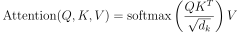

## 方法要点

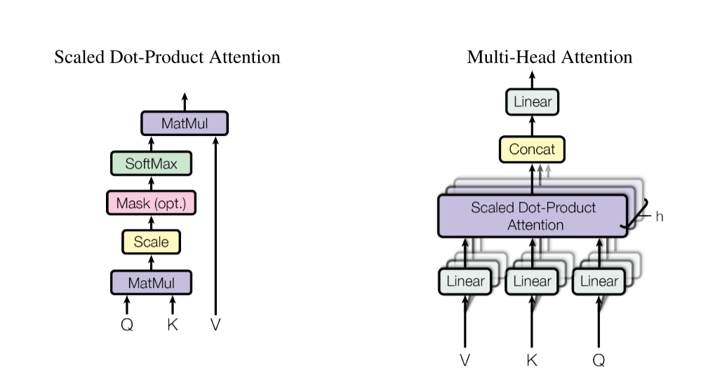

### Attention机制详解(Scaled Dot-Product Attention（缩放点积注意力）+Multi-Head Attention（多头注意力）)

目标：给定一个序列，如何让每个元素关注其他元素，并融合有用信息

输入：

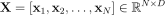

其中每个 x 是一个 token（如一个点、一个词、一个图像 patch）

输出：


1. 生成Q,K,V（查询、键、值）

对每个输入向量x，经过线性变换得到三个向量

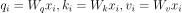

W 是可学习权重，所有token共享这些权重。Query (Q)：当前 token 想“我在当前位置 i 想找什么”？（比如：“我需要找附近的车”）；Key (K)：其他 token 能“我在位置 j 提供什么”？（比如：“我是车”、“我是路”）；Value (V)：其他 token 的“实际内容”（用于加权聚合）

2. 计算注意力分数（相似度）

我们想知道 token i 应该多关注 token j? 这里用点积衡量query和key的相似度：

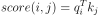

但点积会随着维度增大而变大，导致softmax梯度消失。所以进行缩放：

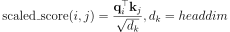

3. Softmax 归一化 -> 注意力权重

对每个i, 将他对所有j的分数做softmax，其分布在[0,1]之间，且总和为1，可用于表示 token i 对token j 的关注度:

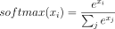

4. 加权求和value -> 输出

用注意力权重对所有Value加权，这就是上下文感知的表示，不仅包含自己，还融合了相关token的信息：

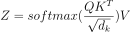

再简单点说，每个词先计算它和所有词的相似度（QKᵀ），再把这些相似度变成概率（softmax），最后用这些概率去加权所有词的信息（V）。

5. 多头机制(Multi-Head)

单头注意力可能只学到一种关系（比如“空间邻近”）。我们希望模型同时关注多种关系（如“语义相似”、“几何对称”等）。于是，将Q, K, V 分成 h 个头，每个头独立计算注意力，然后拼接所有头的输出，最后投影一次，融合多头信息。

这样的好处在于模型自动学习不同视角，例如：头1关注局部邻居；头2关注同类物体；头3关注对称结构······

### 前馈网络(FFN)

对自注意力输出的上下文特征进行非线性加工，提取更高层次的语义表示，使模型不仅能“看到全局”，还能“理解含义”。

假设有一个图像，其中某个位置 x 经过自注意力机制后，已经融合了周围“车”、“路”、“人”的信息，得到一个上下文感知的特征向量：x=[0.8, 0.2, 0.1, 0.9], 这个向量能大致表示：第1维高 → 可能和“车”相关；第4维高 → 可能和“金属反光”相关；第2、3维低 → 不太像“人”或“植被”。但此时，这个向量只是多个邻居的加权平均（来自自注意力），本质上还是线性组合，表达能力有限。

进入feedforward之后(例如nn.Linear(4, 16) → ReLU → nn.Linear(16, 4))，先升维，将4维输入映射到16维隐藏空间，并ReLu激活，在这个更大的空间里，模型可以组合原始特征，发现更复杂的模式。例如：如果 “车” + “金属反光” 同时出现 → 激活某个神经元（比如第5个）→ 表示“这是一辆轿车”；或如果 “车” + “大体积” → 激活另一个神经元 → 表示“这是卡车”。这些高阶语义概念无法通过简单的加权平均得到，必须靠非线性变换。

接着降维回原空间，把 16 维的丰富表示压缩回 4 维输出，现在，输出 z 不仅包含原始信息，还融入了经过非线性推理后的高级语义。

### 残差连接

当堆叠多个transformerblock时，会遇到梯度消失以及退化问题；这里利用残差连接环节梯度消失 -> 让深层网络可以训练；防止退化 -> 深层至少不比浅层差；保留原始信息 -> 避免过渡平滑，避免token趋于相似。

如果某层注意力“搞砸了”，把有用信息抹掉了，残差连接还能把原始信号拉回来。

### 位置编码

Transformer没有顺序结构，完全靠注意力机制。词序对语言至关重要，所以在transformer中显式注入位置信息。

论文中采用正弦/余弦函数构造位置编码，可处理任意长度序列，能让模型学到相对位置关系。我们要为序列中每个位置生成一个唯一的 d 维向量，这个向量要能唯一标识位置，蕴含相对位置信息，且能泛化到训练时没见过的长度。

假设："Je voudrais commander une pizza avec du fromage s'il vous plaît."长度为12的一个词，"pizza" 在位置 pos = 5，"fromage"（奶酪）在位置 pos = 8，相对距离是3，如果看到 ‘pizza’，那么 3 个词之后可能是 ‘fromage’。我们想知道位置编码能否帮助模型捕捉这种“距离为 3”的关系？

作者提出了相关的理论：

1. 编码差值可通过线性变换近似表示。

对于任意固定偏移量 k，存在一个线性变换矩阵W_k, 使得：

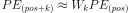

也就是说：知道位置 pos 的编码，就能通过一个固定的线性操作，预测出 pos+k 的编码！

而三角函数刚好能实现这一点。已知三角恒等式：sin(a+b)=sinacosb+cosasinb，cos(a+b)=cosacosb−sinasinb，令：

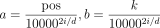

且定义：

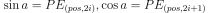

则有：

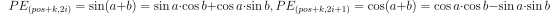

所以进一步：

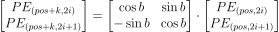

这个变换矩阵不依赖于 pos，只依赖于偏移量 k 和频率索引 i.这意味着只要知道当前位置的编码 ，就可以通过一个固定的线性操作（由 k 决定），预测出任意偏移 k 后的位置编码。

回顾之前的例子，模型在处理 "pizza"（pos=5）时，其位置编码是 PE_5, 那么它就可以“想象”出位置 8 的编码应该是W_3·PE_5, 然后去检查实际位置 8 的内容是否匹配

作者在上述内容基础上做出相关位置编码的定义：

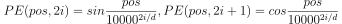

其中 pos 表示位置，i 表示维度。也就是说，位置编码的每个维度都对应一个正弦波。波长从 2π 到 10000·2π 构成一个几何级数。我们选择这个函数是因为我们假设它能让模型轻松地通过相对位置来学习关注，因为对于任何固定的偏移量 k，PE_(pos_k) 可以表示为 PE_pos 的线性函数。这里引出关于**维度对**的概念，每两个维度是一组，每一对 (sin, cos) = 一个“旋转坐标系”（类似二维圆），可以唯一表示一个位置（pos）

**这里维度dim就是特征维度, 整个位置编码是PE(pos) = concat(pair_0,pair_1,pair_2,...),每个都是向量对，位置编码本质是一个高维向量，但它是由很多“二维旋转单元（sin, cos对）”组成的**

如果特征维度是2，那么对应就是二维向量，具体的线性表示已经提过；但到更高维度的特征维度，向量层级进一步增大，但仍可以分为两个向量为一组的表示方法；其核心是attention的点积。

假设此时特征维度升到4维，

```text
PE(pos) = [
  sin₁, cos₁,   ← 第1对（高频）
  sin₂, cos₂    ← 第2对（低频）
]
```

现在再看两个词，pizza和fromage, 设pizza → pos = p；fromage → pos = q；Δ = q - p。它们对应的编码为：PE(p) = [s₁(p), c₁(p), s₂(p), c₂(p)]；PE(q) = [s₁(q), c₁(q), s₂(q), c₂(q)]

那么attention做**点积**：PE(p)⋅PE(q) = s₁(p)s₁(q) + c₁(p)c₁(q) + s₂(p)s₂(q) + c₂(p)c₂(q)，利用恒等式：sinasinb+cosacosb=cos(a−b)，所以有：第1对 → cos(Δ × 频率1)，第2对 → cos(Δ × 频率2)。那么总体上：点积 = cos(Δ·freq₁) + cos(Δ·freq₂)，即每一个二维对都在贡献一个“Δpos信号”，最后被加在一起。

以此类推，可以扩展到128/256维。

**位置编码不是一个二维结构，而是“很多二维旋转单元的线性叠加”，attention 正是通过这种叠加来恢复相对位置**

进而，Q,K,V的实现可以推出：我们希望attention能反映(i−j)。每个token的输入是xi​=ei​+PE(i)，即语义编码+位置编码。

进入Q/K的线性变换之后，

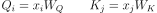

展开可得：

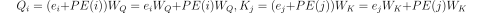

将其点积之后展开：

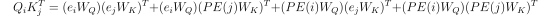

而我们真正需要关注位置相关项：即：

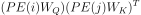

代入positional encoding的结构，也可以用同样的方法从一个维度对推广至全局维度对。尽管不是理想情况，即W_Q,W_K不是单位矩阵，但仍然是线性变换，这就不会破坏频率结构。总结起来：**QK之间是cos(ω(i-j)) 的线性组合，那么一句话中两组词的i-j相同，即位置差相同，其位置表示相同，但是语义表示不同**。

在Q,K结合之后，再加入V。不过位置信息只存在于QK, 不在V本身。V_j = 语义信息 + 一点位置信息（通常较弱）；但V 不负责“计算位置关系”，它只负责“携带信息”，在加权求和V这一步就意味着我从所有 token 中按权重“拿信息”。我们不希望位置被“混进内容”，我们希望例如 “cat” 在任何位置语义都一样；如果假如V，则会破坏“相对位置不变性”。简单的来记就是：QK找相对关系，V来找内容，且话的内容不因为他站哪里而改变。模型会学到“把位置信息从 V 中忽略”

在Je t’aime → I love you的例子中：让decoder生成love；Q（当前位置 i）：我想找一个“动词” ->K（所有 j）：Je / t / aime -> QK 结果：aime → 权重最高(语义匹配 + 位置关系（可能靠近相关词）) -> V 的作用：取出 aime 的语义信息 -> 最终推出 love ≈ aime 的语义


2. 低维捕捉局部，高维捕捉全局

在例子中，pizza → pos = 5， fromage → pos = 8，假设 dim=4;则有：pizza的位置编码为：dim0: sin(5 / 1)，dim1: cos(5 / 1)；dim2: sin(5 / 100)，dim3: cos(5 / 100)。fromage的位置编码为dim0: sin(8 / 1)，dim1: cos(8 / 1)；dim2: sin(8 / 100)，dim3: cos(8 / 100)

在低维度（dim0,1）:pizza: sin(5), cos(5); fromage: sin(8), cos(8)。变化差异极大；但在高维（dim2,3）：pizza: sin(0.05), cos(0.05)；fromage: sin(0.08), cos(0.08)。变化很小！！

每一个维度其实是对应一个频率（1/10000^(2i/d)），低维度就是高频，变化快；高维度就是低频，变化慢。低维度对位置变化非常敏感，能区分相邻词语，所以可以捕捉局部关系。高维度对位置不敏感，所以就更关注整体趋势，能捕捉全局结构，就是所在句子的大致位置。

**在了解完位置编码之后，应该能清晰的意识到不止是语义的影响，更有相对位置的影响**

### 代码实现

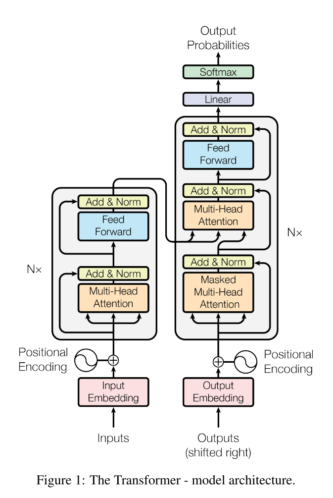

```python
import torch
import torch.nn as nn
import torch.nn.functional as F
import math

# 位置编码
class PositionalEncoding(nn.Module):
    def __init__(self, dim, max_len=5000):
        super().__init__()
        # pe[i, :] 将存储第 i 个位置的编码向量，max_len=5000 是预设最大序列长度
        pe = torch.zeros(max_len, dim)
        # shape: (max_len, 1)，例如[[0], [1], [2], ..., [4999]]
        position = torch.arange(0, max_len, dtype=torch.float).unsqueeze(1)
        # div_term = torch.exp( [0,2,4,6] * (-ln(10000) / 8) )
        div_term = torch.exp(
            torch.arange(0, dim, 2).float() * (-math.log(10000.0) / dim)
        )
        # 论文中的关键公式，偶数维：sin；奇数维：cos
        pe[:, 0::2] = torch.sin(position * div_term)
        pe[:, 1::2] = torch.cos(position * div_term)
        # 注册一个不参与梯度更新的张量（位置编码是固定的！），并添加 batch 维度，便于广播
        self.register_buffer('pe', pe.unsqueeze(0))  # (1, max_len, dim)

    def forward(self, x):
        # x: (B, N, dim)
        return x + self.pe[:, :x.size(1), :]

# 专门用于自注意力机制，仅用于Q=K=V来自于同一个输入的情况
class MultiHeadSelfAttention(nn.Module):
    # 构造函数，接收输入特征维度和头数，例如dim=256, num_heads=8
    def __init__(self, dim, num_heads):
        super().__init__()
        # 确保输入特征维度可以被头数整除
        assert dim % num_heads == 0
        self.dim = dim
        self.num_heads = num_heads
        self.head_dim = dim // num_heads

        # Q, K, V projections
        # 定义线性层用于生成查询（Q）、键（K）和值（V）向量, 虽然输入和输出维度都是dim，但在后续计算过程中会被分成num_heads个头，每个头的维度是head_dim
        self.Wq = nn.Linear(dim, dim)
        self.Wk = nn.Linear(dim, dim)
        self.Wv = nn.Linear(dim, dim)

        # Output projection
        # 多头拼接后，用此层做最终投影
        self.Wo = nn.Linear(dim, dim)

    # 只接收一个输入 x
    def forward(self, x):
        # 输入x的形状是(B, N, D)，其中B是批量大小，N是序列长度，D是特征维度
        # 例如Je t'aime -> B=1, N=3, D=256(随机设置)
        B, N, D = x.shape
        # 1. 生成Q, K, V向量，形状仍然是(B, N, D)
        Q = self.Wq(x)
        K = self.Wk(x)
        V = self.Wv(x)

        # 2. 将Q, K, V分成num_heads个头，每个头的维度是head_dim
        # view(···): 将最后一维D拆成(num_heads, head_dim)
        # transpose(1,2): 把head维度提到前面，便于矩阵运算
        # 最终形状：[B, num_heads, N, head_dim]
        '''
        假设num_heads为8，那么以 Q.shape=(1,3,4) 举例：
        batch 0:
            pos0: [q00, q01, q02, q03]
            pos1: [q10, q11, q12, q13]
            pos2: [q20, q21, q22, q23]
        step 1: Q.view(B, N, num_heads, head_dim) -> Q = Q.view(1, 3, 2, 2), 把最后一个维度 4 拆成 (2 heads × 2 dim)：
        Q.shape = (1, 3, 2, 2)
        batch 0:
        pos0: 
            head0: [q00, q01]
            head1: [q02, q03]
        pos1:
            head0: [q10, q11]
            head1: [q12, q13]
        pos2:
            head0: [q20, q21]
            head1: [q22, q23]
        step 2: 但为了高效矩阵乘法（让 head 维度靠近 batch），我们需要把 head 维度提前: Q = Q.transpose(1, 2)  # 交换第1维(N)和第2维(H)
        Q.shape = (1, 2, 3, 2); 这里batch和head_num是一样的，放在前两维
        batch 0:
        head0:
            pos0: [q00, q01]
            pos1: [q10, q11]
            pos2: [q20, q21]
        head1:
            pos0: [q02, q03]
            pos1: [q12, q13]
            pos2: [q22, q23]
        '''
        Q = Q.view(B, N, self.num_heads, self.head_dim).transpose(1, 2)
        K = K.view(B, N, self.num_heads, self.head_dim).transpose(1, 2)
        V = V.view(B, N, self.num_heads, self.head_dim).transpose(1, 2)

        # 3. 计算注意力权重
        '''
        4维矩阵乘法的本质规则: 对于每一个 (B, H)，单独做一次矩阵乘法;
        矩阵乘法只发生在最后两个维度上，其余维度都是“批处理维度”
        得到一个(1, 2, 3, 3)的矩阵
        '''
        attn_scores = Q @ K.transpose(-2, -1) / (self.head_dim ** 0.5)
        attn_probs = F.softmax(attn_scores, dim=-1)

        # 4. 加权求和得到每个头的输出
        # 进一步得到(1, 2, 3，2)的输出矩阵
        out = attn_probs @ V 

        # 5. 将多个头的输出拼接起来
        # 恢复成(1, 3, 4)的形式，每个词看所有词
        out = out.transpose(1, 2).contiguous().view(B, N, D)

        # 6. 输出投影
        out = self.Wo(out)

        return out

# 通用多头注意力机制，可用于自注意力机制或交叉注意力机制
class MultiHeadAttention(nn.Module):
    def __init__(self, dim, num_heads):
        super().__init__()
        assert dim % num_heads == 0
        self.dim = dim
        self.num_heads = num_heads
        self.head_dim = dim // num_heads

        self.Wq = nn.Linear(dim, dim)
        self.Wk = nn.Linear(dim, dim)
        self.Wv = nn.Linear(dim, dim)
        self.Wo = nn.Linear(dim, dim)

    # 接收三个独立张量，q,k,v，允许来自不同来源；例如 q 来自 Decoder; k/v 来自Encoder，且支持mask
    def forward(self, q, k, v, mask=None):
        # Je t'aime -> B=1, Nq=3, D=256(随机设置)
        # q从decoder中得到, 比如生成 love 时，decoder输入 I, 长度为Nq=1，encoder输入[Je, t, aime]，Nk = 3，所以q,k,v 的shape不一样
        B, Nq, D = q.shape
        Nk = k.shape[1]

        Q = self.Wq(q)
        K = self.Wk(k)
        V = self.Wv(v)

        '''
        这里 Q 为 (1, 2, 1, 2), K,V 为 (1, 2, 3, 2), 当前decoder token 去看所有encoder的所有token
        Q,K^t 相乘之后得到 (1, 2, 1, 3)，与V相乘后得到(1, 2, 1, 2)
        之后恢复为(1, 1, 3), 为下一个 decoder 输入
        '''
        Q = Q.view(B, Nq, self.num_heads, self.head_dim).transpose(1, 2)
        K = K.view(B, Nk, self.num_heads, self.head_dim).transpose(1, 2)
        V = V.view(B, Nk, self.num_heads, self.head_dim).transpose(1, 2)

        attn = Q @ K.transpose(-2, -1) / (self.head_dim ** 0.5)


        # mask 是decoder可以用于生成的关键，可以屏蔽位置，并让有效位置才归一化，忽略padding, 防止decoder看到未来词
        if mask is not None:
            attn = attn.masked_fill(mask == 0, float('-inf'))

        attn = torch.softmax(attn, dim=-1)

        out = attn @ V
        out = out.transpose(1, 2).contiguous().view(B, Nq, D)

        return self.Wo(out)

class FeedForward(nn.Module):
    def __init__(self, dim):
        super().__init__()
        self.net = nn.Sequential(
            # 第一层线性变换将输入特征维度从dim扩展到dim*4，增加模型的表达能力
            nn.Linear(dim, dim * 4),
            # ReLU激活函数引入非线性，使模型能够学习更复杂的特征关系
            nn.ReLU(),
            # 第二层线性变换将特征维度从dim*4压缩回dim，保持与输入维度一致，便于后续的残差连接
            nn.Linear(dim * 4, dim)
        )

    def forward(self, x):
        return self.net(x)

class EncoderBlock(nn.Module):
    def __init__(self, dim, num_heads):
        super().__init__()

        self.attn = MultiHeadAttention(dim, num_heads)
        self.ffn = FeedForward(dim)

        self.norm1 = nn.LayerNorm(dim)
        self.norm2 = nn.LayerNorm(dim)

    def forward(self, x):
        # === Attention ===
        attn_out = self.attn(x, x, x)
        x = x + attn_out         # 残差
        x = self.norm1(x)

        # === FFN ===
        ffn_out = self.ffn(x)
        x = x + ffn_out          # 残差
        x = self.norm2(x)

        return x

class DecoderBlock(nn.Module):
    def __init__(self, dim, num_heads):
        super().__init__()

        # 1. masked self-attention
        self.self_attn = MultiHeadAttention(dim, num_heads)

        # 2. cross attention
        self.cross_attn = MultiHeadAttention(dim, num_heads)

        self.ffn = FeedForward(dim)

        self.norm1 = nn.LayerNorm(dim)
        self.norm2 = nn.LayerNorm(dim)
        self.norm3 = nn.LayerNorm(dim)

    def forward(self, x, enc_out, tgt_mask=None, src_mask=None):
        # 1. Masked Self-Attention（用 tgt_mask 防止看未来）
        x = x + self.self_attn(x, x, x, mask=tgt_mask)
        x = self.norm1(x)

        # 2. Cross-Attention（用 src_mask 忽略源端 padding）
        x = x + self.cross_attn(x, enc_out, enc_out, mask=src_mask)
        x = self.norm2(x)

        # 3. FFN
        x = x + self.ffn(x)
        x = self.norm3(x)
        return x

'''
Causal mask 是结构性的：由任务逻辑决定（不能看未来）
Padding mask 是数据相关的：由具体输入决定（忽略填充）
'''

def generate_causal_mask(size):
    # 因果掩码，生成下三角 causal mask，用于 Decoder 自注意力
    mask = torch.tril(torch.ones(size, size))  # (size, size)
    return mask.unsqueeze(0).unsqueeze(0)      # (1, 1, size, size)

def generate_padding_mask(seq, pad_token_id=0):
    # 填充掩码，生成 padding mask: 1=有效, 0=padding，应用于Encoder 自注意力 + Decoder 交叉注意力
    return (seq != pad_token_id).unsqueeze(1).unsqueeze(2)  # (B, 1, 1, N)

class Transformer(nn.Module):
    def __init__(self, src_vocab_size, tgt_vocab_size, dim=512, num_heads=8, num_encoder_layers=6, num_decoder_layers=6):
        super().__init__()
        self.dim = dim

        # Embeddings
        self.src_emb = nn.Embedding(src_vocab_size, dim)
        self.tgt_emb = nn.Embedding(tgt_vocab_size, dim)

        # Positional Encoding
        self.pos_enc = PositionalEncoding(dim)

        # Encoder & Decoder Stacks
        self.encoder_layers = nn.ModuleList([
            EncoderBlock(dim, num_heads) for _ in range(num_encoder_layers)
        ])
        self.decoder_layers = nn.ModuleList([
            DecoderBlock(dim, num_heads) for _ in range(num_decoder_layers)
        ])

        # Output projection
        self.output_proj = nn.Linear(dim, tgt_vocab_size)

        # 初始化参数（可选）
        self._init_weights()

    def _init_weights(self):
        for p in self.parameters():
            if p.dim() > 1:
                nn.init.xavier_uniform_(p)

    def forward(self, src_ids, tgt_ids, src_pad_idx=0, tgt_pad_idx=0):
        """
        src_ids: (B, N_src)
        tgt_ids: (B, N_tgt)
        """
        B, N_src = src_ids.shape
        B, N_tgt = tgt_ids.shape

        # ===== 1. Embedding + Positional Encoding =====
        src = self.src_emb(src_ids) * math.sqrt(self.dim)  # 缩放嵌入（论文建议）
        tgt = self.tgt_emb(tgt_ids) * math.sqrt(self.dim)
        src = self.pos_enc(src)
        tgt = self.pos_enc(tgt)

        # ===== 2. Generate Masks =====
        # Source padding mask (for encoder self-attn & decoder cross-attn)
        src_mask = generate_padding_mask(src_ids, src_pad_idx)  # (B, 1, 1, N_src)

        # Target causal mask + padding mask
        tgt_causal_mask = generate_causal_mask(N_tgt).to(tgt.device)  # (1, 1, N_tgt, N_tgt)
        tgt_pad_mask = generate_padding_mask(tgt_ids, tgt_pad_idx)    # (B, 1, 1, N_tgt)
        tgt_mask = tgt_causal_mask & tgt_pad_mask                     # (B, 1, N_tgt, N_tgt)

        # ===== 3. Encoder =====
        enc_out = src
        for layer in self.encoder_layers:
            enc_out = layer(enc_out, src_mask=src_mask)

        # ===== 4. Decoder =====
        dec_out = tgt
        for layer in self.decoder_layers:
            dec_out = layer(dec_out, enc_out, tgt_mask=tgt_mask, src_mask=src_mask)

        # ===== 5. Output logits =====
        logits = self.output_proj(dec_out)  # (B, N_tgt, tgt_vocab_size)
        return logits

'''
# 假设参数:
src_vocab_size = 1000   # 源语言词表大小
tgt_vocab_size = 1000   # 目标语言词表大小
dim = 256               # 特征维度 
num_heads = 8           # 多头注意力的头数
num_layers = 3          # 层数

# 创建模型
model = Transformer(
    src_vocab_size=src_vocab_size,
    tgt_vocab_size=tgt_vocab_size,
    dim=dim,
    num_heads=num_heads,
    num_encoder_layers=num_layers,
    num_decoder_layers=num_layers
)

# 模拟数据
B, N_src, N_tgt = 2, 5, 4   (batchsize, 源序列长度，目标序列长度)
src_ids = torch.randint(1, src_vocab_size, (B, N_src))  # 假设 0 是 <pad>
tgt_ids = torch.randint(1, tgt_vocab_size, (B, N_tgt))

# 前向传播
logits = model(src_ids, tgt_ids)  # (2, 4, 1000)

print("Output logits shape:", logits.shape)
# Output logits shape: torch.Size([2, 4, 1000])
'''

```

## 补充说明

### Encoder and Decoder Stacks

Encoder每一层包含两个子层：即之前提到过的Multi-Head Self-Attention Mechanism以及Position-wise Fully Connected Feed-Forward Network (FFN)，每个子层之间使用残差连接+层归一化

多头注意力机制的输入来自上一层，Q\K\V都来自同一个地方，所以称为自注意力机制，目的是让序列中每个位置都能关注到序列中所有其他位置的信息。

FFN对每个位置独立应用相同的全连接网络（两层线性变换+ReLU）

Decoder每一层包含三个子层：Masked Multi-Head Self-Attention，Multi-Head Attention over Encoder Output以及Position-wise FFN。同样使用残差连接+LayerNorm

Masked Multi-Head Self-Attention 与 Encoder 的 Self-Attention 类似，但加了 掩码（Masking）目的是防止当前位置关注未来位置（保持自回归性质）。

Multi-Head Attention over Encoder Output（Encoder-Decoder Attention）中Query 来自 Decoder 的上一层，Key 和 Value 来自 Encoder 的最终输出。这就是传统 Seq2Seq 中的“注意力机制”，让 Decoder 能动态关注输入序列的相关部分。

Position-wise FFN（同 Encoder）


## 一些想法

真的就是跨时代的论文！除了崇拜无话可说


## 相关工作

[RoFormer: Enhanced Transformer with Rotary Position Embedding](https://arxiv.org/abs/2104.09864)
