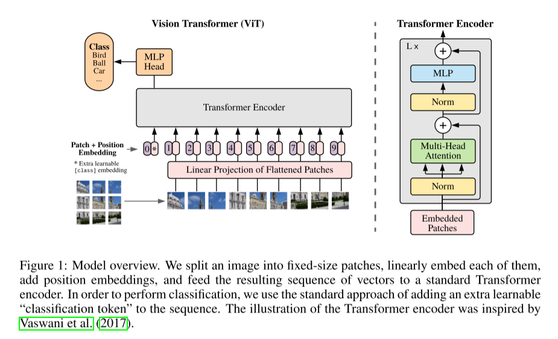

# ViT 阅读汇报

## 论文信息

- 标题：An Image is Worth 16x16 Words: Transformers for Image Recognition at Scale
- 作者 / 会议或期刊：ICLR
- 链接：[https://arxiv.org/abs/2010.11929](https://arxiv.org/abs/2010.11929)

## 一句话概括

ViT具有里程碑式的作用，首次成功地将纯Transformer架构直接应用于图像识别任务。

## 方法要点

### 简介

Transformer凭借自注意力机制成为NLP的主流框架，它不再依赖RNN/CNN，而是通过全局建模词与词的关系，实现并行化和长距离依赖捕捉。尽管在2020年前，ResNet仍然是主流SOTA，但作者认为既然Transformer在NLP中“大力出奇迹”，那么如果不做复杂修改，只做最小适配，是否也能为CV领域带来新的曙光？作者提出了属于图像的Transformer技术：

关键技术就是图像分块(Patch Embedding): 将 HxWxC 的图像划分为 N=HW/(P^2) 个 PxP 的patch，

每个 patch 展开为 (P^2)C维向量，经过线性投影得到 embedding

图像经过上述处理，变为一个token序列，就像句子中的单词序列！“Image patches are treated the same way as tokens (words) in an NLP application.”

最开始的效果其实并不如ImageNet, 原因主要是Transformer 是完全数据驱动的，没有任何关于“空间局部性”或“平移不变性”的先验。在小数据上容易过拟合，泛化差。转折点随之来到：大数据改变一切！作者提出了革命性理论：当数据足够大时，模型可以从数据中自动学习到空间结构，无需人为设计归纳偏置！

ViT应运而生！ViT的三大贡献可以归纳维：1. 极简设计：直接将标准 Transformer 应用于图像 patch 序列，几乎不做修改；2. 颠覆认知：证明大规模数据可以替代 CNN 的归纳偏置，挑战了 CV 的基本假设；3. 开启新范式：为后续 MAE、Swin、DeiT 等工作铺路，推动 “纯 Transformer 视觉模型” 时代到来。

图中展示了ViT的经典结构，假设现在有一个224*224*3的图像，输入ViT处理。ViT的输入为：图像+标签

1. 图像分块，将224*224*3的图像进行分块处理，划分为patch_size=16*16的patch，所以对应的就会有14*14个patch。

2. 将patch进行展开，本来一个patch是16*16*3个向量，这里展开为一个768维向量。

3. 线性投影，将768维的向量投影到dim(例如256)特征维度上，这就等价于Transformer的embedding dim

4. 拼接class token，class token之后的作用是一个相当于集成了全局信息的token

5. 加入位置编码，class token设置为0，如这里一共197*256维位置编码，pos_embed.shape = (1, N+1, D)。这里和transformer有一点不一样，原来的transformer不可学习，有相对位置结构，是sin/cos的固定函数，但是这里是完全自由学习的位置编码，等同于ViT让模型自己学每个位置。

6. 送入transformer encoder

7. 取class token经过MLP做分类

## 一些想法

ViT的篇幅其实并不多，但是已经说明白了其核心思想，极具价值；它首次将Transformer应用到图像领域，它甚至没怎么改整体的框架，不过实现了前人没有做到的事情，这就是贡献！

