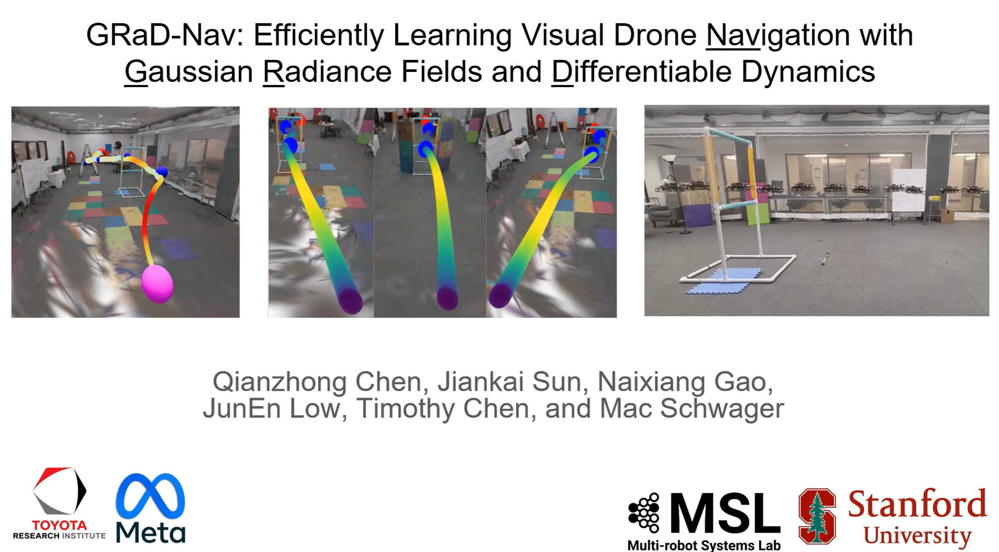
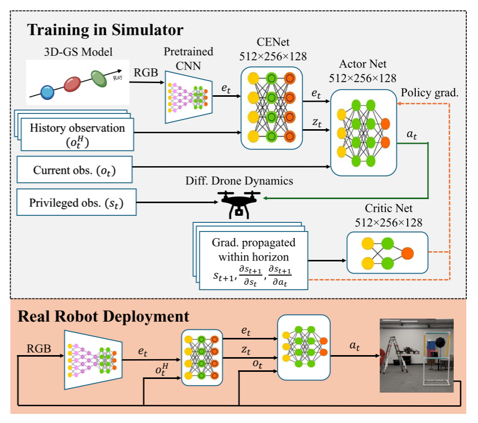
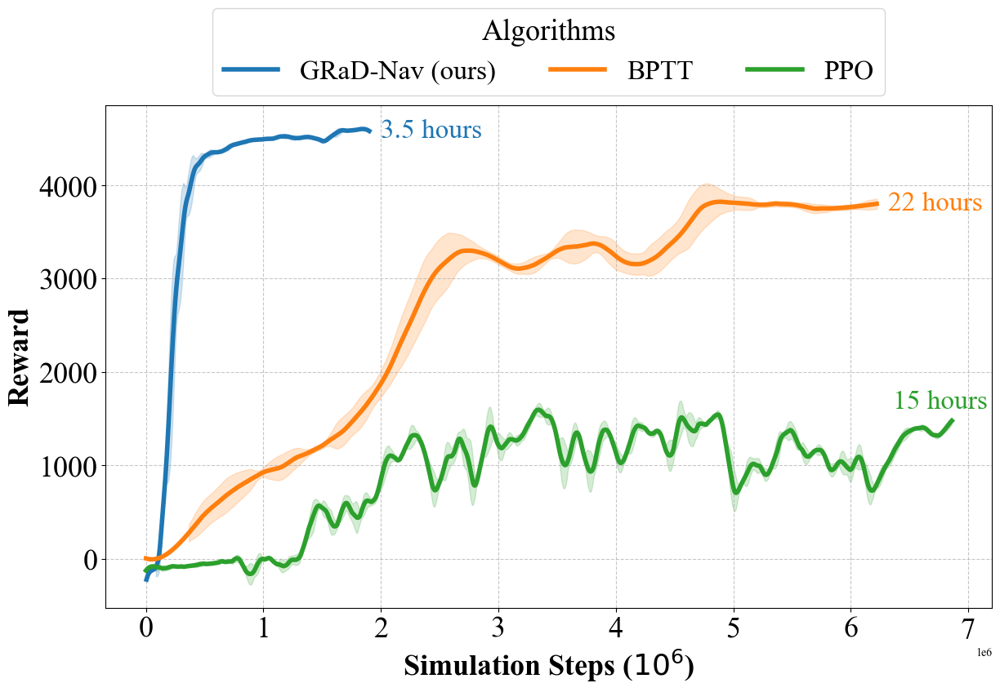
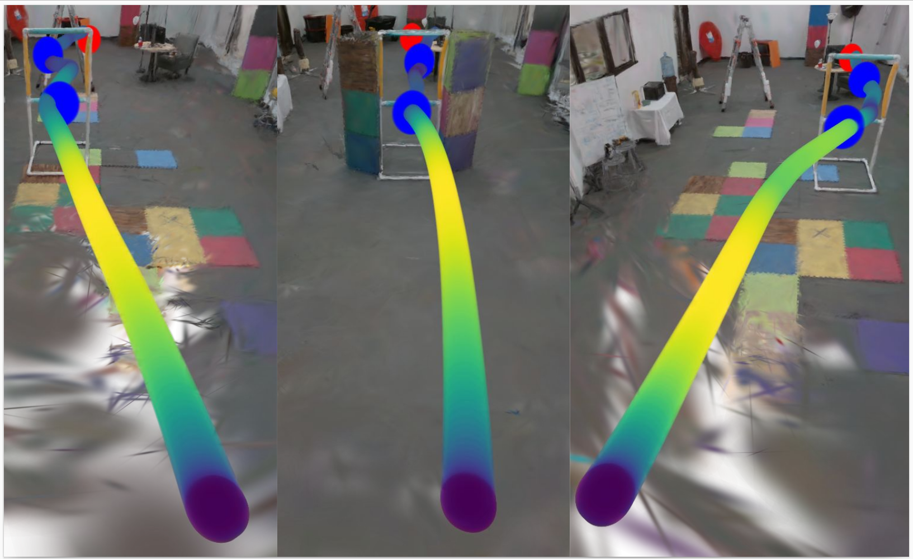
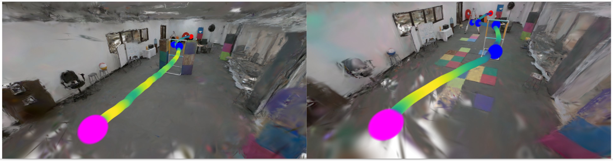

# grad-nav 阅读汇报

## 论文信息

- 标题：GRaD-Nav: Efficiently Learning Visual Drone Navigation with Gaussian Radiance Fields and Differentiable Dynamics
- 作者 / 会议或期刊：IROS
- 链接：[https://arxiv.org/abs/2503.03984](https://arxiv.org/abs/2503.03984)

## 一句话概括
本文提出了 GRaD-Nav 框架，该框架将 3DGS 与可微分深度强化学习 DDRL 相结合，用于训练基于视觉的无人机导航策略，显著提升了样本效率和仿真到现实的迁移性能；同时，还引入了上下文辅助估计器网络 CENet ，以实现在动态环境中的运行时适应能力。

## 方法要点

现实需求：自主无人机有可能改善农业、环境监测、搜索和救援等领域的实践。传统方法主要依赖于不同模块的堆叠。然而，这些不同模块的集成存在许多问题，包括系统复杂度高、模块间通信延迟以及模块间难以表征的误差传播。机器学习的最新进展为这些挑战提供了替代解决方案。利用深度强化学习，机器人有可能学会直接将传感器输入映射到控制输出。然而，强化学习在使用传统模拟器训练策略时也面临着获取高质量感知数据的困难这一关键瓶颈。此外，强化学习在样本效率方面表现不佳，限制了策略训练的速度。

<figure style="margin: 24px 0;">
  
  <figcaption style="font-size: 0.9em; color: #666; margin-top: 8px; text-align: left; line-height: 1.5;">
    上半部分：在模拟器中训练策略 & 下半部分：在真实无人机上部署策略 
    (Training in Simulator & Real Robot Deployment) 
    核心思想：在高保真仿真环境中用可微物理模型端到端训练一个“看图飞行”的策略，然后无需微调，直接部署到真实无人机上运行。在模拟训练阶段，3DGS为系统提供环境图像，CNN提取图像特征，CENet生成环境的潜在表示，演员和评论家网络则优化无人机的飞行策略。在实际部署阶段，系统能够无缝地将训练中学到的策略应用于真实环境。通过实时获取RGB图像，提取特征并生成潜在表示，演员网络根据这些信息生成控制命令，指导无人机飞行。
  </figcaption>
</figure>

**训练阶段**
- 3DGS模型负责生成逼真的环境场景，它为无人机提供RGB图像，模拟环境的外观；
- Pretrained CNN 负责从3DGS渲染的RGB图像中提取特征，生成视觉嵌入；
- CENet处理历史观测、当前观测和特权观测。它将这些输入转化为潜在表示，总结环境和动态信息，增强系统在运行时对环境变化的适应能力；
- 演员网络接收CENet生成的潜在向量和视觉特征，然后根据这些信息生成控制动作，即无人机应该执行的行为；
- 评论家网络估算给定状态下的价值，它评估演员生成的动作的好坏，帮助演员调整策略；
- Differentiable Drone Dynamics模拟无人机的动力学，提供准确的飞行动力学计算，并允许通过梯度回传来优化策略。通过使用可微分仿真，系统能够计算状态和动作的梯度，并反向传播这些梯度用于训练；
- 在强化学习的训练过程中，通过梯度传播来优化策略。

**部署阶段**
- 在实际部署阶段，无人机通过其RGB摄像头实时捕捉环境图像；
- 与训练阶段相似，预训练的CNN会从无人机的摄像头图像中提取特征，生成视觉嵌入
- CENet继续对当前的RGB图像进行处理，生成潜在的环境表示，使得无人机能够适应实际环境；
- 演员网络根据CENet生成的潜在环境表示和当前观测，演员网络生成对应的动作，控制无人机进行飞行；
- 在实际部署阶段，无人机根据生成的动作进行飞行，并完成实际任务。

在这篇文章中，3D Gaussian Splatting（3DGS）被用于为无人机提供高保真度的视觉感知。具体来说，3DGS利用一组连续的各向异性3D高斯体元（primitives）来表示和渲染3D场景。这种方法将3D场景表示为多个高斯分布的集合，每个高斯体元通过位置、协方差矩阵、颜色和不透明度等参数来定义，从而实现高效的场景建模和实时渲染。3DGS能够在训练过程中渲染逼真的RGB图像，模拟无人机的第一视角，并提供与环境交互所需的3D点云数据。这些数据不仅被用来为深度强化学习提供训练样本，还可用来为任务规划（如设置奖励航点）和碰撞检查提供支持。

文章中通过结合3DGS与可微分深度强化学习（DDRL），实现了端到端的无人机视觉导航训练。3DGS负责渲染高质量的环境图像，而可微分的无人机动力学模拟负责在每个时间步计算状态转移（例如位置、速度和姿态），并通过PyTorch的计算图计算梯度。这种结合使得整个系统能够通过梯度反向传播优化控制策略（即导航策略）。具体来说，DDRL框架中的短时地平线演员-评论家（SHAC）方法使用3DGS模型生成的图像来计算每个动作的奖励，并通过微分仿真获得关于行动和状态变化的梯度信息，帮助优化导航策略。通过将3DGS场景模型和无人机动力学模型纳入DDRL训练中，系统能够更加高效地学习到适应不同环境的导航策略。

  

引入上下文辅助估计器网络（Context Estimator Network, CENet）旨在提升无人机在运行时对环境变化的适应能力。CENet的核心作用是通过对环境的视觉感知（如RGB图像）进行编码，将周围环境的关键信息压缩成一个潜在向量（latent vector），该向量总结了与障碍物和其他动态因素的空间关系。CENet通过一个β变分自编码器（β-VAE）结构来处理这些信息，提取环境的上下文特征，并将其提供给导航策略网络。通过这种方式，CENet可以在不同的环境中对无人机的行为进行实时调节，使其能够在面对新的环境变化（如新的障碍物或不同的任务实例）时，仍然保持较高的导航性能。具体来说，CENet通过对过去5个时间步的历史观测进行处理，生成潜在向量，这些向量成为导航策略的输入，帮助无人机实时调整动作以应对当前的环境条件。

在GRaD-Nav中，演员-评论家架构被用于训练无人机的导航策略。具体来说：演员网络（Policy Network）负责生成无人机的动作（例如飞行方向、速度等），并与环境互动。评论家网络（Value Network）则估计给定状态下的价值或Q值，评估演员所采取动作的好坏，并为演员提供反馈，以指导演员网络学习更有效的控制策略。演员-评论家（Actor-Critic）网络结构是一种在强化学习（RL）中常见的策略网络架构，它结合了策略网络（Actor）和价值网络（Critic）。这种结构旨在通过同时优化策略和价值函数来提高训练效率和稳定性，特别是在复杂的任务中。演员网络负责生成动作（或策略），即根据当前的状态（环境）选择一个行动,演员网络通过接受当前状态作为输入，然后输出一个动作的概率分布或直接生成一个具体的动作。在某些情况下（如连续动作空间），输出可以是一个动作的具体值（例如，速度、角度等）；在其他情况下（如离散动作空间），输出可以是一个动作的概率分布，表示选择每个可能动作的概率。评论家网络估计每个状态或状态-动作对的价值，即评估给定状态（或状态-动作对）下采取某个动作的“好坏”。评论家的目标是为演员提供反馈，帮助演员改进其策略。评论家网络输入当前的状态（或状态-动作对）并输出该状态的价值或该状态-动作对的Q值（在Q学习中使用）。这些值用于告诉演员当前的行动是否有益，以及如何调整策略。在演员-评论家结构中，演员和评论家分别独立工作，但又紧密合作。评论家为演员提供状态的价值反馈，而演员根据评论家的评价来调整其策略。具体来说，评论家的目标是通过值函数来预测每个状态的好坏，而演员则通过优化策略函数来选择最优的动作。这种结构使得GRaD-Nav能够在训练过程中进行高效的状态-动作评估，优化无人机的飞行行为，尤其是在复杂和动态变化的环境中。

  
  

<video controls style="width: 90%; max-width: 720px; display: block; margin: 16px auto;">
  <source src="../images/grad-nav.mp4" type="video/mp4">
</video>

### 一些想法

文章中的GRaD-Nav框架结合了 3DGS 和 DDRL，使得它能够通过高质量的视觉数据和真实的物理模拟来训练无人机的导航策略。3DGS 提供了非常高保真的环境表示，从而弥补了传统模拟器中视觉信息不够真实的缺陷。可微分的动力学仿真允许在训练中反向传播梯度，优化控制策略，从而加速了训练过程。
不过尽管文中提到GRaD-Nav展示了强大的zero-shot sim-to-real 转移能力，但是否真的有较强的泛化性存疑？

### 相关工作（可选）
[GRaD-Nav++: Vision-Language Model Enabled Visual Drone Navigation with Gaussian Radiance Fields and Differentiable Dynamics](https://arxiv.org/abs/2506.14009)
